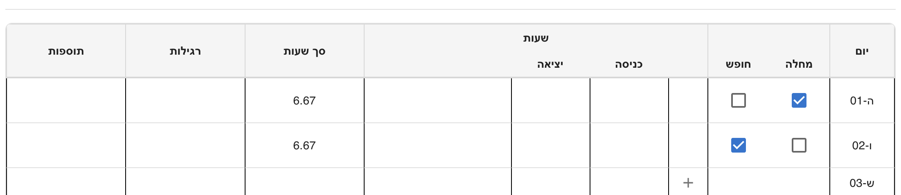
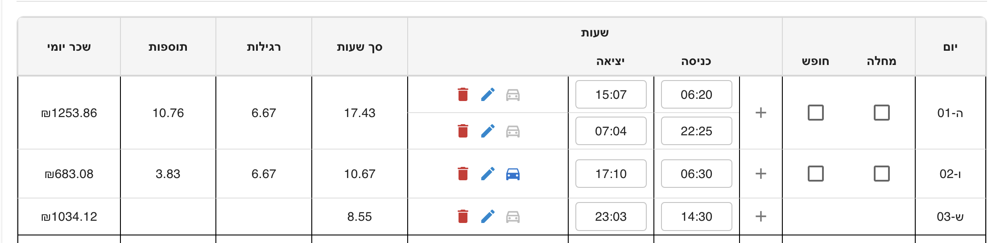

# Shiftly – Work Hours Tracking & Calculation System

[](https://dmaman86.github.io/shiftly/)
[](https://deepwiki.com/dmaman86/shiftly)

> 📘 Hebrew version available: [README_HE.md](./README_HE.md)

**Shiftly** is a work-hours tracking and salary calculation application built with **React + TypeScript**.
It is designed to accurately calculate monthly salary based on daily shifts, special days, per-diem rules, and real-world labor regulations.

The project focuses not only on correctness, but on **clear domain modeling, architectural stability, and long-term maintainability**.

> ⚠️ This system provides **indicative calculations only**.  
> The results should not be used for official payroll purposes  
> and do not replace calculations performed by an authorized payroll department.

---

## Core Design Principles

The core principle behind Shiftly is that **calculation logic remains stable over time**.

Salary rules do not change per implementation, but per **period context**.
Dates, daylight saving time, hourly rates, per-diem rules, and allowances are treated as inputs rather than hardcoded logic.

This makes is possible to **recalculate past months accurately** using the same calculation pipeline, simply by changing the contextual parameters - without modifying domain code.

---

## Features

- Shift-based salary calculation
- Support for:
  - Regular workdays
  - Partial special days (e.g. Fridays, holiday eves)
  - Full special days (Shabbat, holidays)
- **Holiday detection via Hebcal API**
  - Automatic resolution of Jewish holidays
  - Differentiation between full and partial special days
- Sick days & vacation days
- Cross-day shifts
- Per-diem calculation with historical rate timeline
- Meal allowance calculation (small / large)
- Monthly aggregated breakdown
- Incremental recalculation (add / update / remove shifts)
- Fully reactive UI

---

## Architecture Overview

Shiftly follows a **Clean Architecture–inspired design**, with a strong emphasis on keeping business rules isolated from UI, state management, and external services.

The goal is to ensure that domain logic remains **predictable, testable, and unaffected by framework or UI changes**.

### High-Level Flow

Shift -> Day -> Month

Each level is calculated independently and aggregated incrementally.

---

## Architectural Layers

### Domain

The domain layer contains **pure business logic** and is framework-agnostic.

- **Builders**
  Construct domain structures without embedding business rules.

- **Calculators**
  Pure functions implementing salary rules.

- **Reducers**
  Handle accumulation and rollback of calculated values, enabling incremental recalculation.

- **Resolvers**
  Decision logic based on time, date, and contextual rules.

- **Factories & Composition**
  Centralized wiring of domain components.

### Adapters

Convert domain objects into UI-friendly view models.
This ensures the domain never depends on presentation concerns.

### Hooks

Thin orchestration layer between UI, domain, and state.
Hooks coordinate data flow without embedding business logic.

### State Management (Redux)

- Global and monthly state aggregation
- Deterministic add / subtract logic
- No full recomputation on every change

Key slices:

- `workDaysSlice`
- `globalSlice`

### UI Components

Pure presentation logic.
UI reacts to data - it does not implement salary rules.

---

## Domain Concepts

### Builders

Responsible for assembling domain structures:

- `ShiftMapBuilder`
- `ShiftSegmentBuilder`
- `DayPayMapBuilder`
- `WorkDaysForMonthBuilder`

### Calculators

Pure calculation logic organized by concern:

- **Regular hours**: by shift / by day
- **Extra & special segments**: time-based bonuses
- **Per-diem**: shift / day / month levels
- **Meal allowance**: eligibility & rate calculation

### Reducers

Accumulate and subtract breakdowns:

- Monthly pay map reducer
- Regular hours accumulator
- Fixed segment month reducer
- Meal allowance month reducer
- Workday month reducer

### Resolvers

Context-aware decision logic:

- Holiday resolver (Hebcal-based)
- Shift segment resolver
- Timeline-based per-diem rate resolver
- Timeline-based meal allowance rate resolver
- Month resolver
- Workday info resolver

### Services

Domain-level utilities:

- `DateService`: Date manipulation and validation
- `ShiftService`: Shift-related business logic

### Pipelines

Composition pipelines for wiring domain components:

- `buildCoreServices`: Date & shift services
- `buildResolvers`: All resolver instances
- `buildCalculators`: Calculator instances
- `buildShiftLayer`: Shift-level logic
- `buildDayLayer`: Day-level aggregation
- `buildMonthLayer`: Month-level aggregation

### Factories

Create specific calculator instances:

- `FixedSegmentFactory`
- `RegularFactory`

---

## Tech Stack

### Core

- **React** 19.2.3
- **TypeScript** 5.7.2
- **Vite** 6.2.0

### State & Routing

- **Redux Toolkit** 2.11.0
- **React Router** 7.11.0

### UI & Styling

- **Material UI (MUI)** 7.0.2
- **Notistack** 3.0.2 (notifications)

### Data & Services

- **Axios** 1.9.0 (HTTP client)
- **date-fns** 4.1.0 (date manipulation)
- **Hebcal API** (holiday detection)

### Testing

- **Vitest** 4.0.16
- **Testing Library** (React, Jest-DOM, User Event)

---

## Testing

Shiftly uses **Vitest** for unit and integration testing, with a focus on domain logic validation.

### Running Tests

```bash
# Run tests in watch mode
npm run test

# Run tests with UI
npm run test:ui

# Run tests with coverage
npm run test:coverage

# Run tests in CI mode (single run)
npm run test:ci
```

### Test Coverage

Tests cover:

- Calculation logic (builders, calculators, reducers)
- Time-based resolution (holidays, rates, segments)
- Edge cases (cross-day shifts, partial days, sick/vacation)
- End-to-end calculation scenarios

The domain layer is fully testable and framework-independent, making it easy to validate business rules in isolation.

---

## Getting Started

Clone the repository and install dependencies:

```bash
git clone https://github.com/dmaman86/shiftly.git
cd shiftly
npm install
npm run dev
```

Visit `http://localhost:5173/shiftly` in your browser.

---

## Project Structure

```plaintext
src/
├── app/              # Application shell
│   ├── domain/       # Domain instance & wiring
│   ├── providers/    # Context providers
│   └── routes/       # Route configuration
├── domain/           # Business logic (framework-agnostic)
│   ├── builder/      # Domain structure builders
│   ├── calculator/   # Salary calculation logic
│   │   ├── regular/
│   │   ├── special/
│   │   ├── perdiem/
│   │   └── mealallowance/
│   ├── reducer/      # State accumulation & rollback
│   ├── resolve/      # Context-aware decisions
│   ├── factory/      # Component factories
│   ├── pipelines/    # Composition pipelines
│   ├── services/     # Domain services (date, shift)
│   └── types/        # Type definitions
├── adapters/         # Domain -> UI view models
├── features/         # Feature-specific UI modules
│   ├── calculation-rules/
│   ├── config/
│   ├── info-dialog/
│   ├── salary-summary/
│   ├── work-table/
│   └── workday-timeline/
├── hooks/            # React hooks (orchestration layer)
├── hoc/              # Higher-order components
├── layout/           # Layout components & error boundaries
├── pages/            # Page components (Daily, Monthly, Rules)
├── redux/            # State management
│   └── states/       # Redux slices
├── services/         # External services
│   ├── analytics/    # Salary feedback service
│   └── hebcal/       # Holiday API integration
├── constants/        # Application constants
└── utils/            # Helper utilities
```

---

## Why This Architecture?

This architecture was chosen to handle:

- Complex salary rules
- Time-based edge cases (cross-day shifts, partial days)
- Multiple aggregation levels (shift → day → month)
- Incremental recalculation without full recompute
- Historical accuracy without modifying core logic

It allows the system to scale **without turning into tightly coupled conditional logic** inside UI components or reducers.

---

## Implementation Notes

- All percentages are normalized (e.g. `1` = 100%, `1.5` = 150%, `2` = 200%)
- Domain logic is framework-agnostic and fully testable
- UI reacts to data, not business rules
- Historical calculations use time-based context, not code changes

---

## UI Behavior Overview

## Application Views

Shiftly provides two main calculation views:

### Daily View

- Focused on day-by-day shift input
- Allows adding, editing, and validating shifts
- Displays per-day breakdown
- Monthly totals are updated incrementally

### Monthly View

- Focused on aggregated monthly salary analysis
- Requires selecting **year and month**
- Ensures accurate per-diem and meal allowance rates based on period
- Displays a compact monthly salary summary

Both views share the same domain calculation pipeline.
Only the presentation and configuration context changes.

### Configuration Panel

The `ConfigPanel` adapts its behavior based on the active view:

- In **Daily mode**:
  - Allows defining standard hours and hourly rate
  - Monthly values are derived incrementally

- In **Monthly mode**:
  - Year and month selection becomes mandatory
  - Ensures correct historical rates for per-diem and meal allowance
  - Enforces hourly rate definition for salary calculation

This separation keeps configuration logic explicit and context-aware.

### Workday Overview

- If `baseRate` is **not set**: only displays worked hours per day.
- If `baseRate` is **set**: shows per-day salary and monthly total.
- **Sick/Vacation days**: disables work segments.
- **Shabbat/holiday**: only allows work, not absence.
- **Cross-day shifts**: user must confirm with a checkbox.

### Day Configuration Examples

#### Shabbat or Holiday - Work Hours Allowed

Cannot mark as Sick/Vacation, but work segments are allowed.


#### Sick Day or Vacation Day - No Work Segments

Marked as Sick/Vacation; no work segments allowed.



#### Cross-Day Shift - "חוצה יום" Checkbox

End time is next day; system asks to confirm crossing day.

|                      Cross-Day Warning                       |                   Shift Save                   |
| :----------------------------------------------------------: | :--------------------------------------------: |
|  |  |

---

### Breakdown Summaries

#### Daily Breakdown - Expanded View

Detailed breakdown showing all calculation components for a single day.

|                     Breakdown Summary 1                      |                     Breakdown Summary 2                      |
| :----------------------------------------------------------: | :----------------------------------------------------------: |
|  |  |

#### Daily Breakdown - Compact View

Condensed view for quick daily salary overview.



#### Monthly Summary

Aggregated monthly salary calculation with all components.


---

## License

This project is licensed under the [MIT License](LICENSE).
