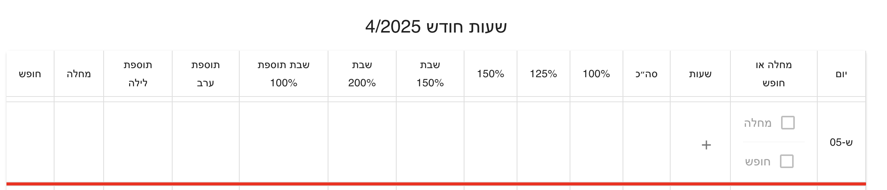
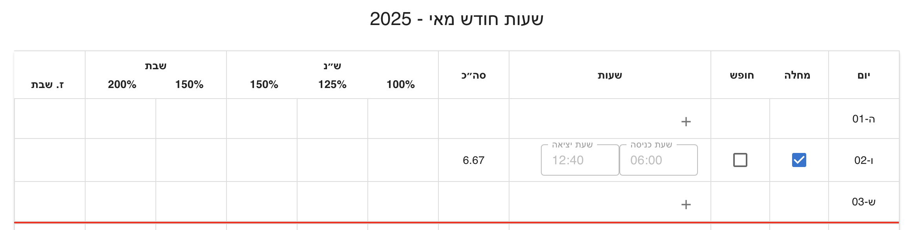
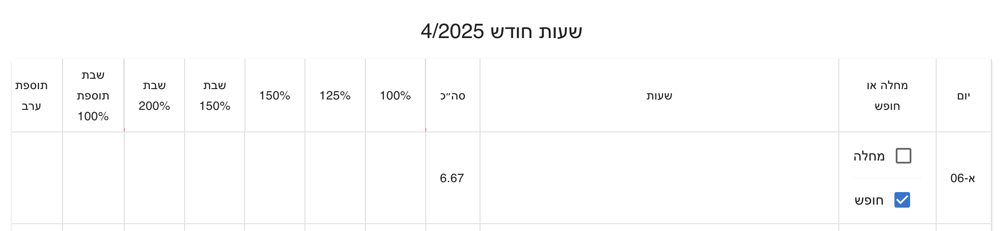
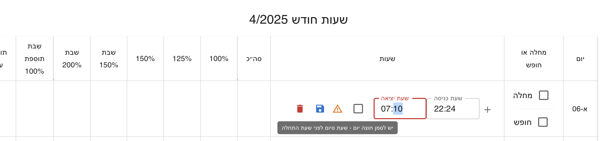
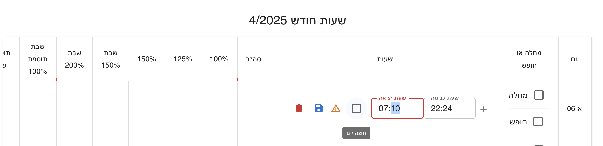
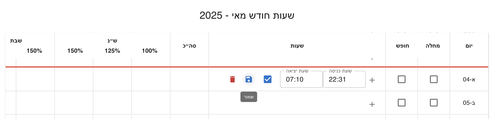
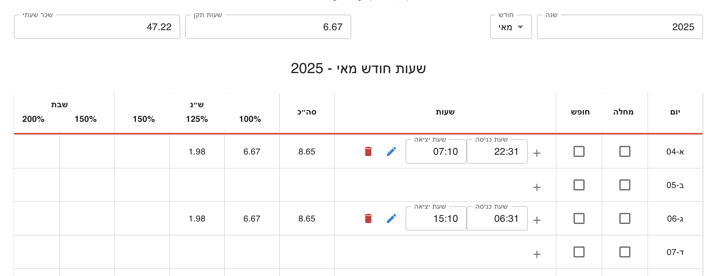
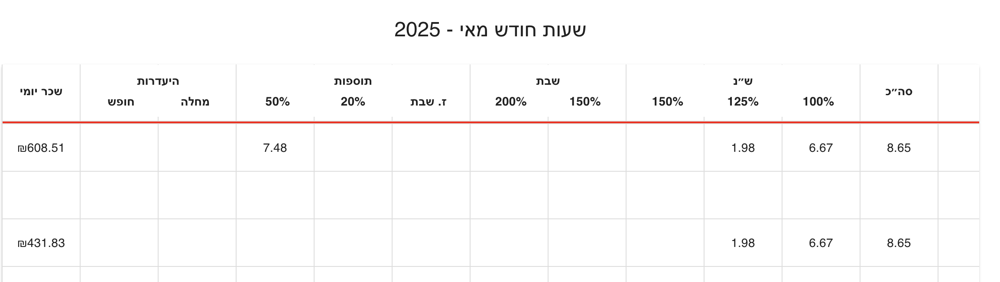
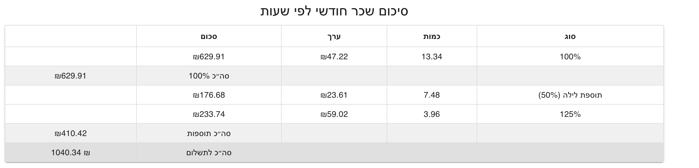

# Shiftly – Work Hours Tracking & Calculation System

[](https://dmaman86.github.io/shiftly/)

**Shiftly** is a salary and shift calculation application built with **React + TypeScript**, designed to accurately compute monthly pay based on daily shifts, special days, per-diem rules, and complex labor regulations.

The project focuses not only on correctness, but on **clear domain modeling, clean architecture, and long-term maintainability**.

---

## Features

- Shift-based salary calculation
- Support for:
  - Regular workdays
  - Partial special days (e.g. Fridays, holiday eves)
  - Full special days (Shabbat, holidays)
- **Holiday detection via Hebcal API**
  - Automatic resolution of Jewish holidays
  - Differentiation between full and partial special days
- Sick days & vacation days
- Cross-day shifts
- Per-diem calculation with historical rate timeline
- Monthly aggregated breakdown
- Incremental recalculation (add / update / remove shifts)
- Fully reactive UI

---

## Architecture Overview

Shiftly follows a **Clean Architecture–inspired design**, separating business logic from UI and state management.

### Layers

- **Domain**
  - Builders
  - Calculators
  - Reducers
  - Resolvers
  - Factories
- **Adapters**
  - Convert domain objects to UI-friendly view models
- **Redux**
  - Global and monthly state aggregation
- **Hooks**
  - Thin orchestration layer between UI and domain
- **UI Components**
  - Pure presentation logic

---

## Tech Stack

- React
- TypeScript
- Redux Toolkit
- MUI (Material UI)
- Vite
- Hebcal API

---

## Domain Concepts

### Builders

Responsible for constructing complex structures:

- `ShiftMapBuilder`
- `DayPayMapBuilder`
- `WorkDaysForMonthBuilder`

### Calculators

Pure calculation logic:

- Regular hours calculators (by shift / by day)
- Extra & special segment calculators
- Per-diem calculators (shift, day, month)

### Reducers

Accumulate and subtract breakdowns:

- Monthly pay map reducer
- Regular hours accumulator

### Resolvers

Decision logic based on time, date, and rules:

- Holiday resolver (Hebcal)
- Shift segment resolver
- Per-diem rate resolver (timeline-based)

---

## State Management

- **Redux Toolkit** manages global state
- Monthly totals are updated incrementally
- No full recomputation on every change
- Deterministic add / subtract logic

Key slices:

- `workDaysSlice`
- `globalSlice`

---

## Getting Started

Clone the repository and install dependencies:

```bash
git clone https://github.com/dmaman86/shiftly.git
cd shiftly
npm install
npm run dev
```

Visit `http://localhost:5173/shiftly` in your browser.

---

## Project Structure (Simplified)

```plaintext
src/
├── domain/
│ ├── builder/
│ ├── calculator/
│ ├── reducer/
│ ├── resolver/
│ ├── factory/
│ └── types/
├── adapters/
├── hooks/
├── redux/
├── components/
└── utils/
```

---

## Why This Architecture?

This architecture was chosen to handle:

- Complex salary rules
- Cross-day logic
- Multiple aggregation levels (shift → day → month)
- Clear separation between calculation and presentation

It allows the project to scale **without turning into a “logic soup”** inside React components or Redux reducers.

---

## Notes

- All percentages are normalized (e.g. `1`, `1.5`, `2`, `0.2`)
- Domain logic is framework-agnostic
- UI reacts to data, not business rules

---

## UI Behavior Overview

### Workday Overview

- If `baseRate` is **not set**: only displays worked hours per day.
- If `baseRate` is **set**: shows per-day salary and monthly total.
- **Sick/Vacation days**: disables work segments.
- **Shabbat/holiday**: only allows work, not absence.
- **Cross-day shifts**: user must confirm with a checkbox.

### Day Configuration Logic

**Shabbat or Holiday - Work Hours Allowed**

- Cannot mark as Sick/Vacation, but work segments are allowed.
  

**Sick Day Or Vacation Day - Not Work Segments**

- Marked as Sick/Vacation; nor work segments allowed.
  
  

**Cross-Day Shift - "חוצה יום" Checkbox**

- End time is next day; system asks to confirm crossing day.
  
  
  

**Breakdown Day Summary**



**Monthly Summary**


---

## License

This project is licensed under the [MIT License](LICENSE).
