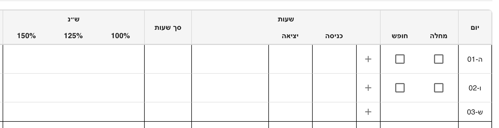
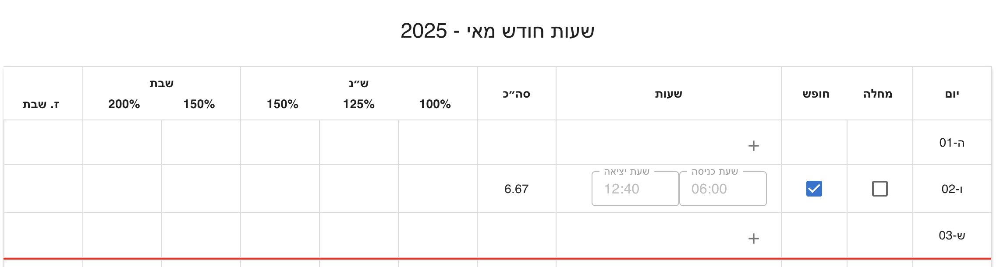
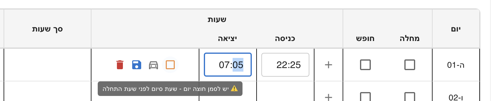
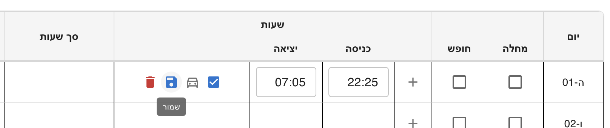
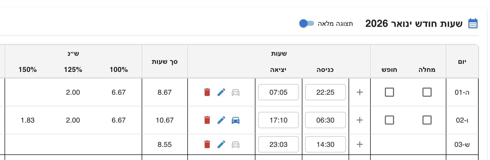
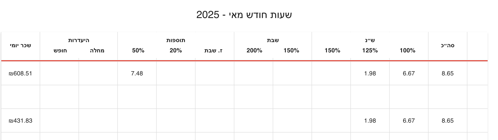

# Shiftly – Work Hours Tracking & Calculation System

[](https://dmaman86.github.io/shiftly/)

> 📘 Hebrew version available: [README_HE.md](./README_HE.md)

**Shiftly** is a work-hours tracking and salary calculation application built with **React + TypeScript**.
It is designed to accurately calculate monthly salary based on daily shifts, special days, per-diem rules, and real-world labor regulations.

The project focuses not only on correctness, but on **clear domain modeling, architectural stability, and long-term maintainability**.

> ⚠️ This system provides **indicative calculations only**.  
> The results should not be used for official payroll purposes  
> and do not replace calculations performed by an authorized payroll department.

---

## Core Design Principles

The core principle behind Shiftly is that **calculation logic remains stable over time**.

Salary rules do not change per implementation, but per **period context**.
Dates, daylight saving time, hourly rates, per-diem rules, and allowances are treated as inputs rather than hardcoded logic.

This makes is possible to **recalculate past months accurately** using the same calculation pipeline, simply by changing the contextual parameters - without modifying domain code.

---

## Features

- Shift-based salary calculation
- Support for:
  - Regular workdays
  - Partial special days (e.g. Fridays, holiday eves)
  - Full special days (Shabbat, holidays)
- **Holiday detection via Hebcal API**
  - Automatic resolution of Jewish holidays
  - Differentiation between full and partial special days
- Sick days & vacation days
- Cross-day shifts
- Per-diem calculation with historical rate timeline
- Meal allowance calculation (small / large)
- Monthly aggregated breakdown
- Incremental recalculation (add / update / remove shifts)
- Fully reactive UI

---

## Architecture Overview

Shiftly follows a **Clean Architecture–inspired design**, with a strong emphasis on keeping business rules isolated from UI, state management, and external services.

The goal is to ensure that domain logic remains **predictable, testable, and unaffected by framework or UI changes**.

### High-Level Flow

Shift -> Day -> Month

Each level is calculated independently and aggregated incrementally.

---

## Architectural Layers

### Domain

The domain layer contains **pure business logic** and is framework-agnostic.

- **Builders**
  Construct domain structures without embedding business rules.

- **Calculators**
  Pure functions implementing salary rules.

- **Reducers**
  Handle accumulation and rollback of calculated values, enabling incremental recalculation.

- **Resolvers**
  Decision logic based on time, date, and contextual rules.

- **Factories & Composition**
  Centralized wiring of domain components.

### Adapters

Convert domain objects into UI-friendly view models.
This ensures the domain never depends on presentation concerns.

### Hooks

Thin orchestration layer between UI, domain, and state.
Hooks coordinate data flow without embedding business logic.

### State Management (Redux)

- Global and monthly state aggregation
- Deterministic add / subtract logic
- No full recomputation on every change

Key slices:

- `workDaysSlice`
- `globalSlice`

### UI Components

Pure presentation logic.
UI reacts to data - it does not implement salary rules.

---

## Domain Concepts

### Builders

Responsible for assembling domain structures:

- `ShiftMapBuilder`
- `DayPayMapBuilder`
- `WorkDaysForMonthBuilder`

### Calculators

Pure calculation logic:

- Regular hours (by shift / by day)
- Extra & special segment
- Per-diem calculation (shift, day, month)
- Meal allowance calculation

### Reducers

Accumulate and subtract breakdowns:

- Monthly pay map reducer
- Regular hours accumulator
- Fixed segment reducers

### Resolvers

Context-aware decision logic:

- Holiday resolver (Hebcal-based)
- Shift segment resolver
- Timeline-based per-diem and meal allowance rate resolvers

---

## Tech Stack

- React
- TypeScript
- Redux Toolkit
- MUI (Material UI) & Bootstrap
- Vite
- Hebcal API

---

## Getting Started

Clone the repository and install dependencies:

```bash
git clone https://github.com/dmaman86/shiftly.git
cd shiftly
npm install
npm run dev
```

Visit `http://localhost:5173/shiftly` in your browser.

---

## Project Structure (Simplified)

```plaintext
src/
├── domain/         # Business logic (framework-agnostic)
│ ├── builder/
│ ├── calculator/
│ ├── reducer/
│ ├── resolve/
│ ├── factory/
│ └── types/
├── adapters/       # Domain -> UI view models
├── hooks/          # Orchestration layer
├── redux/          # State management
├── components/     # UI components
├── pages/          # Daily & Monthly views
├── context/        # Domain wiring & providers
└── utils/          # Infrastructure helpers
```

---

## Why This Architecture?

This architecture was chosen to handle:

- Complex salary rules
- Time-based edge cases (cross-day shifts, partial days)
- Multiple aggregation levels (shift → day → month)
- Incremental recalculation without full recompute

## It allows the system to scale **without turning into tightly coupled conditional logic** inside UI components or reducers.

## Notes

- All percentages are normalized (e.g. `1`, `1.5`, `2`, `0.2`)
- Domain logic is framework-agnostic
- UI reacts to data, not business rules

---

## UI Behavior Overview

## Application Views

Shiftly provides two main calculation views:

### Daily View

- Focused on day-by-day shift input
- Allows adding, editing, and validating shifts
- Displays per-day breakdown
- Monthly totals are updated incrementally

### Monthly View

- Focused on aggregated monthly salary analysis
- Requires selecting **year and month**
- Ensures accurate per-diem and meal allowance rates based on period
- Displays a compact monthly salary summary

Both views share the same domain calculation pipeline.
Only the presentation and configuration context changes.

### Configuration Panel

The `ConfigPanel` adapts its behavior based on the active view:

- In **Daily mode**:

  - Allows defining standard hours and hourly rate
  - Monthly values are derived incrementally

- In **Monthly mode**:
  - Year and month selection becomes mandatory
  - Ensures correct historical rates for per-diem and meal allowance
  - Enforces hourly rate definition for salary calculation

This separation keeps configuration logic explicit and context-aware.

### Workday Overview

- If `baseRate` is **not set**: only displays worked hours per day.
- If `baseRate` is **set**: shows per-day salary and monthly total.
- **Sick/Vacation days**: disables work segments.
- **Shabbat/holiday**: only allows work, not absence.
- **Cross-day shifts**: user must confirm with a checkbox.

### Day Configuration Logic

**Shabbat or Holiday - Work Hours Allowed**

- Cannot mark as Sick/Vacation, but work segments are allowed.
  

**Sick Day Or Vacation Day - Not Work Segments**

- Marked as Sick/Vacation; nor work segments allowed.
  
  

**Cross-Day Shift - "חוצה יום" Checkbox**

- End time is next day; system asks to confirm crossing day.
  
  
  

**Breakdown Day Summary**



**Monthly Summary**


---

## License

This project is licensed under the [MIT License](LICENSE).
