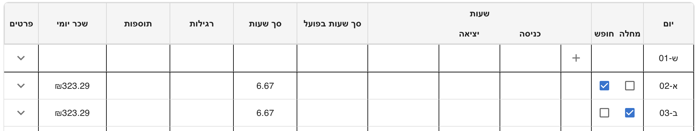
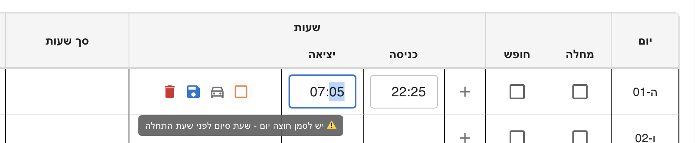
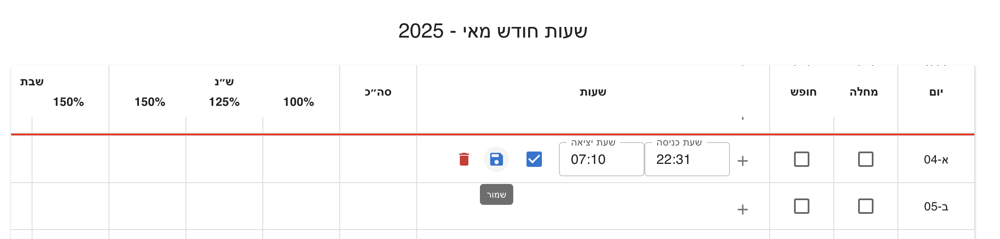
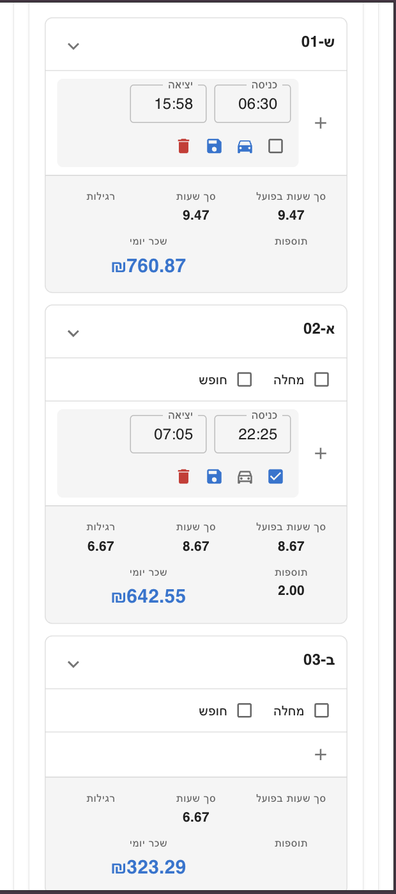
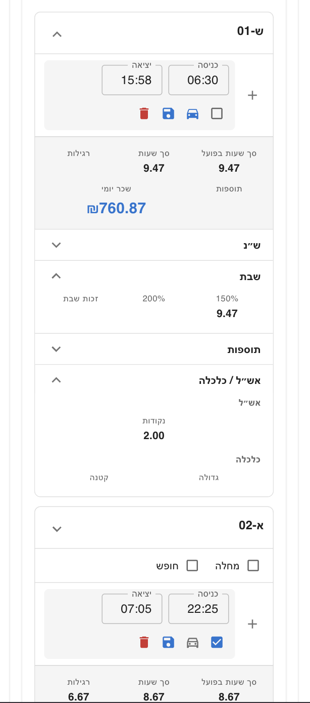

# Shiftly – Work Hours Tracking & Calculation System

[](https://dmaman86.github.io/shiftly/?utm_source=github&utm_medium=readme)
[](https://deepwiki.com/dmaman86/shiftly)


[](https://github.com/dmaman86/shiftly/actions/workflows/ci.yml)

[](https://codecov.io/gh/dmaman86/shiftly)


> 📘 Hebrew version available: [README_HE.md](./README_HE.md)

**Shiftly** is a work-hours tracking and salary calculation application built with **React + TypeScript**.
It is designed to accurately calculate monthly salary based on daily shifts, special days, per-diem rules, and real-world labor regulations.

The project focuses not only on correctness, but on **clear domain modeling, architectural stability, and long-term maintainability**.

> ⚠️ This system provides **indicative calculations only**.  
> The results should not be used for official payroll purposes  
> and do not replace calculations performed by an authorized payroll department.

---

## Motivation

**Shiftly** was born from a recurring problem observed in a real government office environment.

Workers track their time in **shifts** - a continuous block of hours with a clear start and end. But Israeli payslips don't work that way. They operate in **weighted segments:** overtime brackets that reset daily, Shabbat and holiday bonuses that kick in at specific hours, night premiums that split mid-way through.

The result is a predictable source of confusion: employees receive a payslip they can't verify, and have no practical way to cross-check whether the numbers are correct.

**Shiftly** bridges that gap. It takes shift input the way workers actually think - and calculates compensation based on **Israeli labor law:** overtime brackets, Shabbat and holiday bonuses, and night premiums - making the calculation **transparent and verifiable** for the person receiving the paycheck.

---

## Core Design Principles

The core principle behind Shiftly is that **calculation logic remains stable over time**.

Salary rules do not change per implementation, but per **period context**.
Dates, daylight saving time, hourly rates, per-diem rules, and allowances are treated as inputs rather than hardcoded logic.

This makes it possible to **recalculate past months accurately** using the same calculation pipeline, simply by changing the contextual parameters - without modifying domain code.

---

## Features

- Shift-based salary calculation
- Support for:
  - Regular workdays
  - Partial special days (e.g. Fridays, holiday eves)
  - Full special days (Shabbat, holidays)
- **Holiday detection via Hebcal API**
  - Automatic resolution of Jewish holidays
  - Differentiation between full and partial special days
- Sick days & vacation days
- Cross-day shifts
- Per-diem calculation with historical rate timeline
- Meal allowance calculation (small / large)
- Monthly aggregated breakdown
- Incremental recalculation (add / update / remove shifts)
- Fully reactive UI
- Optional Google sign-in with cross-device data persistence

---

## Authentication & Data Persistence

Shiftly works fully **without an account** — everything runs in memory, and nothing is stored anywhere.

Signing in with a **Google account** (via Supabase Auth) additionally persists your data to Supabase, tied to your account, so it carries over across sessions and devices:

- **Monthly configuration** — year, month, standard hours, hourly rate
- **Day status** — sick / vacation marks per day
- **Shifts** — start, end, and duty flag for each saved shift
- **Shabbat credit carry-over** — unused Shabbat credit hours roll forward to the next month instead of being lost

| Table | Stores |
| --- | --- |
| `monthly_configs` | Per-(user, year, month) settings, plus the running Shabbat-credit carry-over balance |
| `work_days` | Per-(user, date) status (`sick` / `vacation`) — a missing row means `normal` |
| `shifts` | Per-user saved shifts, with the date denormalized onto each row for direct querying |

All three tables are protected by Postgres Row Level Security: each user can only read or write their own rows. The schema lives in `supabase/migrations/`.

Authenticated work-table data is loaded with TanStack Query using a cache key scoped to the user, year, and month. Editing remains unavailable until that initial snapshot is ready, and a failed load presents an explicit retry action. Changing accounts resets the editable state before loading the next account's data.

The monthly summary hydrates persisted shifts and day statuses directly when its selected year and month change, so it does not depend on visiting the daily view first.

Valid shift edits are saved after a short debounce. Writes for the same user and day are serialized so a late update cannot overtake a subsequent deletion. Invalid time drafts remain local until they become valid.

---

## Architecture Overview

Shiftly follows a **Clean Architecture–inspired design**, with a strong emphasis on keeping business rules isolated from UI, state management, and external services.

The goal is to ensure that domain logic remains **predictable, testable, and unaffected by framework or UI changes**.

### High-Level Flow

Shift -> Day -> Month

Each level is calculated independently and aggregated incrementally.

---

## Architectural Layers

### Domain

The domain layer contains **pure business logic** and is framework-agnostic.

- **Builders**
  Construct domain structures without embedding business rules.

- **Calculators**
  Pure, dependency-free functions implementing salary rules, time-based segment percentages, and dated-rate lookups.

- **Reducers**
  Handle accumulation and rollback of calculated values, enabling incremental recalculation.

- **Resolvers**
  Multi-method decision services (day-type classification, available months) whose shape doesn't reduce to a single input/output calculation.

- **Composition**
  Centralized wiring of domain components via `pipelines/`.

### Adapters

Convert domain objects into UI-friendly view models.
This ensures the domain never depends on presentation concerns.

### Hooks

Thin orchestration layer between UI, domain, and state.
Hooks coordinate data flow without embedding business logic.

### State Management

- **Zustand** handles global period configuration and daily pay maps
- **React Context** owns authentication, dependency injection, UI integration boundaries, and the current work-table editing session
- **TanStack Query** coordinates authenticated work-table reads and writes to Supabase
- Daily pay maps are updated by date key, and the monthly breakdown is derived deterministically from the current maps

Global Zustand state:

- `src/store/globalStore.ts`
- `src/store/globalBreakdown.ts`

### UI Components

Pure presentation logic.
UI reacts to data - it does not implement salary rules.

---

## Domain Concepts

### Builders

Responsible for assembling domain structures:

- `ShiftMapBuilder`
- `ShiftSegmentBuilder`
- `DayPayMapBuilder`
- `WorkDaysForMonthBuilder`

### Calculators

Pure calculation logic organized by concern:

- **Regular hours**: by shift / by day
- **Extra & special segments**: time-based bonuses
- **Shift segments**: percentage-rate breakdown by time-of-day and Shabbat status
- **Per-diem**: shift / day / month levels, with timeline-based rate lookup
- **Meal allowance**: eligibility & rate calculation, with timeline-based rate lookup
- **Fixed segments**: sick, vacation and earned Shabbat credit
- **Holiday day-type classification**: Hebcal-based

#### Shabbat Credit Terminology

Shabbat credit is modeled as two distinct values because earning credit and using it are separate business events:

- `earnedShabbatCredit` is the credit generated by Shabbat and holiday work. It belongs to the day and month domain pay maps and forms the monthly credit pool.
- `appliedShabbatCredit` is the part of that monthly pool assigned to eligible hour deficits. It belongs to presentation view models and is the only part included in total hours and salary.

The monthly pool can complete unworked or short days classified as `Regular` or `SpecialPartialStart`, regardless of when the credit was earned during the month. A day can only be completed up to its configured standard hours. Distribution is chronological so that the result remains deterministic and auditable.

Any remaining balance is reported as unused Shabbat credit:

```text
unusedShabbatCredit = earnedShabbatCredit - appliedShabbatCredit
actualHours = worked hours
totalHours = worked hours + sick hours + vacation hours + appliedShabbatCredit
```

Unused credit is displayed to the user but is excluded from total hours and salary calculations.

### Reducers

Accumulate and subtract breakdowns:

- Monthly pay map reducer
- Regular hours accumulator
- Fixed segment month reducer
- Meal allowance month reducer
- Workday month reducer

### Resolvers

Multi-method decision services whose shape doesn't reduce to a single input/output calculation:

- Month resolver — available months and default month for a given year
- Workday info resolver — day-type and cross-day-continuation queries

### Services

Domain-level utilities:

- `DateService`: Date manipulation and validation
- `ShiftService`: Shift-related business logic

### Pipelines

Composition pipelines for wiring domain components:

- `buildCoreServices`: Date & shift services
- `buildResolvers`: Month and workday-info resolver instances
- `buildRateCalculators`: Holiday, per-diem rate, and meal-allowance rate calculators
- `buildCalculators`: Calculator instances
- `buildShiftLayer`: Shift-level logic
- `buildDayLayer`: Day-level aggregation
- `buildMonthLayer`: Month-level aggregation

---

## Tech Stack

### Core

- **React** 19.2.3
- **TypeScript** 5.7.2
- **Vite** 8

### State & Routing

- **Zustand** 5.0.15 (global client state)
- **TanStack Query** 5 (authenticated server-state synchronization)
- **React Router** 7

### UI & Styling

- **Material UI (MUI)** 7.0.2
- **Notistack** 3.0.2 (notifications)

### Data & Services

- **Axios** 1.18.1 (HTTP client)
- **date-fns** 4.1.0 (date manipulation)
- **Hebcal API** (holiday detection)
- **Supabase** 2.112.4 (Google OAuth + Postgres persistence)

### Testing

- **Vitest** 4
- **Testing Library** (React, Jest-DOM, User Event)

---

## Testing

Shiftly uses **Vitest** for unit and integration testing, with a focus on domain logic validation.

### Running Tests

```bash
# Run tests in watch mode
bun run test

# Run tests with UI
bun run test:ui

# Run tests with coverage
bun run test:coverage

# Run tests in CI mode (single run)
bun run test:ci
```

### Quality Checks and Production Build

```bash
# Type-check the application and Vite configuration
bun run typecheck

# Run static analysis
bun run lint

# Create the production bundle in dist/
bun run build
```

### Test Coverage

Tests cover:

- Calculation logic (builders, calculators, reducers)
- Time-based resolution (holidays, rates, segments)
- Edge cases (cross-day shifts, partial days, sick/vacation)
- End-to-end calculation scenarios

The domain layer is fully testable and framework-independent, making it easy to validate business rules in isolation.

---

## Getting Started

Shiftly supports Node.js 24 and Bun 1.3.14 or newer within the 1.x release line. The exact Node.js version used by CI is declared in `.nvmrc`, while the Bun version is declared in `package.json`.

Clone the repository, activate the supported runtime, and install dependencies:

```bash
git clone https://github.com/dmaman86/shiftly.git
cd shiftly
nvm install
nvm use
bun install --frozen-lockfile
bun run dev
```

Visit `http://localhost:5173/shiftly` in your browser.

### Supabase Setup (optional)

Guest mode works with no setup at all — nothing is persisted, no account required.

To enable Google sign-in and cross-device data persistence, create a `.env.local` file with your Supabase project's credentials:

```bash
VITE_SUPABASE_URL=
VITE_SUPABASE_PUBLISHABLE_KEY=
```

Then run the SQL files under `supabase/migrations/`, in order, in your Supabase project's SQL Editor to create the `monthly_configs`, `work_days`, and `shifts` tables with their Row Level Security policies.

Account deletion requires the `delete-account` Supabase Edge Function because deleting from `auth.users` requires a server-side secret key. Deploy it after linking the project:

```bash
supabase functions deploy delete-account
```

The function validates the signed-in user's JWT and deletes that same user from Supabase Auth. The table foreign keys use `on delete cascade`, so the user's `monthly_configs`, `work_days`, and `shifts` rows are removed by the database.

---

## Project Structure

```plaintext
.
├── .github/
│   ├── assets/                 # README screenshots
│   └── workflows/              # CI, pull-request checks, deployment
├── src/
│   ├── adapters/               # External data and domain-to-view adapters
│   ├── app/                    # Application composition root
│   │   ├── domain/             # Domain instance and application-facing types
│   │   ├── providers/          # Auth, direction, domain and snackbar providers
│   │   └── routes/             # Application and language-aware routing
│   ├── constants/              # Shared domain and UI constants
│   ├── domain/                 # Framework-independent payroll rules
│   │   ├── builder/            # Shift, day and month structure builders
│   │   ├── calculator/         # Regular, special, segment, rate and credit calculations
│   │   ├── pipelines/          # Domain dependency composition
│   │   ├── reducer/            # Monthly accumulation and rollback
│   │   ├── resolve/            # Multi-method decision services (day-type, month)
│   │   ├── services/           # Date and shift services
│   │   └── types/              # Domain contracts and data shapes
│   ├── features/               # Feature-owned UI and orchestration
│   │   ├── auth/               # Google sign-in controls
│   │   ├── calculation-rules/  # Rules and interactive calculation example
│   │   ├── config/             # Work parameters and persisted monthly config
│   │   ├── feedback/           # User feedback notifications
│   │   ├── info-dialog/        # Application information dialog
│   │   ├── salary-summary/     # Monthly salary components, hooks and view models
│   │   ├── work-table/         # Responsive day/shift editing and persistence sync
│   │   └── workday-timeline/   # Visual shift timeline
│   ├── hooks/                  # Shared React integration hooks
│   ├── i18n/                   # Hebrew/English resources and URL language resolution
│   ├── layout/                 # Application layout and error boundaries
│   ├── pages/                  # Daily, monthly and calculation-rules pages
│   ├── store/                  # Zustand global state and breakdown calculations
│   ├── services/               # Analytics, Hebcal and Supabase persistence clients
│   ├── test/                   # Domain, store, service and UI test suites
│   └── utils/                  # API result handling and shared helpers
└── supabase/
    ├── functions/               # Authenticated Edge Functions
    └── migrations/              # Postgres schema and Row Level Security policies
```

---

## Why This Architecture?

This architecture was chosen to handle:

- Complex salary rules
- Time-based edge cases (cross-day shifts, partial days)
- Multiple aggregation levels (shift → day → month)
- Incremental recalculation without full recompute
- Historical accuracy without modifying core logic

It allows the system to scale **without turning into tightly coupled conditional logic** inside UI components or reducers.

---

## Implementation Notes

- All percentages are normalized (e.g. `1` = 100%, `1.5` = 150%, `2` = 200%)
- Domain logic is framework-agnostic and fully testable
- UI reacts to data, not business rules
- Historical calculations use time-based context, not code changes

---

## UI Behavior Overview

## Application Views

Shiftly provides two main calculation views:

### Daily View

- Focused on day-by-day shift input
- Allows adding, editing, and validating shifts
- Displays per-day breakdown
- Monthly totals are updated incrementally

### Monthly View

- Focused on aggregated monthly salary analysis
- Requires selecting **year and month**
- Ensures accurate per-diem and meal allowance rates based on period
- Loads persisted shifts and day statuses for the selected period independently of the Daily view
- Displays a compact monthly salary summary

Both views share the same domain calculation pipeline.
Only the presentation and configuration context changes.

### Configuration Panel

The `ConfigPanel` adapts its behavior based on the active view:

- In **Daily mode**:
  - Allows defining standard hours and hourly rate
  - Monthly values are derived incrementally

- In **Monthly mode**:
  - Year and month selection becomes mandatory
  - Ensures correct historical rates for per-diem and meal allowance
  - Enforces hourly rate definition for salary calculation

This separation keeps configuration logic explicit and context-aware.

### Workday Overview

- If `baseRate` is **not set**: only displays worked hours per day.
- If `baseRate` is **set**: shows per-day salary and monthly total.
- **Sick/Vacation days**: disables work segments.
- **Shabbat/holiday**: only allows work, not absence.
- **Cross-day shifts**: user must confirm with a checkbox.

### Day Configuration Examples

#### Shabbat or Holiday - Work Hours Allowed

Cannot mark as Sick/Vacation, but work segments are allowed.


#### Sick Day or Vacation Day - No Work Segments

Marked as Sick/Vacation; no work segments allowed.



#### Cross-Day Shift - "חוצה יום" Checkbox

End time is next day; system asks to confirm crossing day.

|                      Cross-Day Warning                       |                   Shift Save                   |
| :----------------------------------------------------------: | :--------------------------------------------: |
|  |  |

---

### Breakdown Summaries

#### Daily Breakdown - Desktop View

Detailed breakdown showing all calculation components for a single day.

|                              Collapsed Details                              |                              Expanded Details                              |
| :-------------------------------------------------------------------------: | :------------------------------------------------------------------------: |
|  |  |

#### Daily Breakdown - Mobile View

|                             Collapsed Details                             |                             Expanded Details                             |
| :-----------------------------------------------------------------------: | :----------------------------------------------------------------------: |
|  |  |

#### Monthly Summary

Aggregated monthly salary calculation with all components.


---

## License

This project is licensed under the [MIT License](LICENSE).
