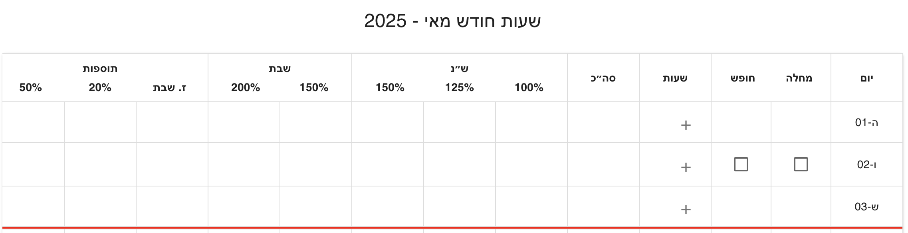

# Shiftly – Work Hours Tracking & Calculation System

[](https://dmaman86.github.io/shiftly/)

**Shiftly** is an advanced work-hour tracking tool that calculates wages based on complex Israeli labor laws, including overtime, night bonuses, and special day rates (Shabbat, holidays, Friday evenings). Built with **React** and **TypeScript**, it provides a visual and editable breakdown for each workday.

## Features

- Track start and end time for each work shift
- Auto-calculates:
  - Base hours (100%)
  - Overtime:
    - First standard hours (default: 6.67h) at 100%
    - Next 2 hours at 125%
    - Any additional hours at 150%
    - `standardHours` is configurable in the salary settings panel
  - Evening bonus (20%)
  - Night bonus (50%)
  - Shabbat and holiday pay:
    - Friday/Holiday Eve night: 150% + 100%
    - Saturday/Holiday: 150% + 100% or 200% + 100% depending on time
- Manual adjustments to breakdown
- Monthly summary based on base hourly rate
- Support for:
  - Sick/Vacation days (non-workable)
  - Cross-day shifts
  - Winter/Summer time cutoffs
- Holiday support via [Hebcal API](https://www.hebcal.com/home/developer-apis)
- RTL layout support for Hebrew

## Tech Stack

- **Frontend**: React + TypeScript + Vite
- **UI**: Material UI (MUI) + Bootstrap
- **HTTP Client**: Axios
- **State Management**: React Hooks
- **Logic & Utilities**: Modularized business logic and segment breakdown utilities

## Getting Started

Clone the repository and install dependencies:

```bash
git clone https://github.com/dmaman86/shiftly.git
cd shiftly
npm install
npm run dev
```

Visit `http://localhost:5173/shiftly` in your browser.

## Project Structure

```plaintext
src/
├── adapters
│   ├── event.adapter.ts
│   └── index.ts
├── assets
│   └── react.svg
├── components
|   ├── __tests__
│   │   ├── ConfigPanel.test.tsx
│   │   ├── MonthlySalarySummary.test.tsx
│   │   ├── PayBreakdownRow.test.tsx
│   │   ├── WorkDayRow.test.tsx
│   │   ├── SegmentRow.test.tsx
│   │   └── WorkTable.test.tsx
│   ├── ConfigPanel.tsx
│   ├── Footer.tsx
│   ├── index.ts
│   ├── MonthlySalarySummary.tsx
│   ├── PayBreakdownRow.tsx
│   ├── SegmentRow.tsx
│   ├── WorkDayRow.tsx
│   └── WorkTable.tsx
├── constants
│   ├── fields.constant.ts
│   ├── hebrew.dates.constant.ts
│   └── index.ts
├── domain
│   ├── index.ts
│   ├── services
│   │   ├── __tests__
│   │   │   ├── breakdown.service.test.ts
│   │   │   ├── breakdownResolve.service.test.ts
│   │   │   └── segmentResolver.service.test.ts
│   │   ├── breakdown.service.ts
│   │   ├── breakdownResolve.service.ts
│   │   ├── holiday.service.ts
│   │   ├── paySegmentFactory.service.ts
│   │   ├── segmentResolver.service.ts
│   │   └── segments.service.ts
│   └── types
│       └── types.ts
├── hooks
│   ├── index.ts
│   ├── useBreakdownDay.ts
│   ├── useFetch.ts
│   ├── useSegments.ts
│   └── useWorkDays.ts
├── utils
│   ├── date.util.ts
│   ├── helpers.util.ts
│   ├── index.ts
│   └── service.util.ts
├── App.css
├── App.tsx
├── index.css
├── main.tsx
└── vite-env.d.ts
```

## UI Behavior Overview

### Workday Overview

- If `baseRate` is **not set**: only displays worked hours per day.
- If `baseRate` is **set**: shows per-day salary and monthly total.
- **Sick/Vacation days**: disables work segments.
- **Shabbat/holiday**: only allows work, not absence.
- **Cross-day shifts**: user must confirm with a checkbox.

### Day Configuration Logic

**Shabbat or Holiday - Work Hours Allowed**

- Cannot mark as Sick/Vacation, but work segments are allowed.
  

**Sick Day Or Vacation Day - Not Work Segments**

- Marked as Sick/Vacation; nor work segments allowed.
  
  

**Cross-Day Shift - "חוצה יום" Checkbox**

- End time is next day; system asks to confirm crossing day.
  
  
  

**Breakdown Day Summary**


**Monthly Summary**


## License

This project is licensed under the [MIT License](LICENSE).
