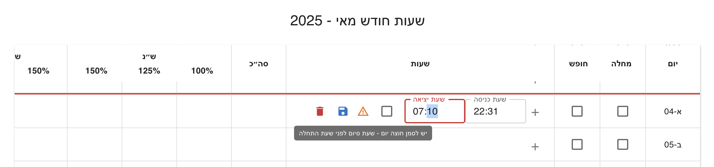
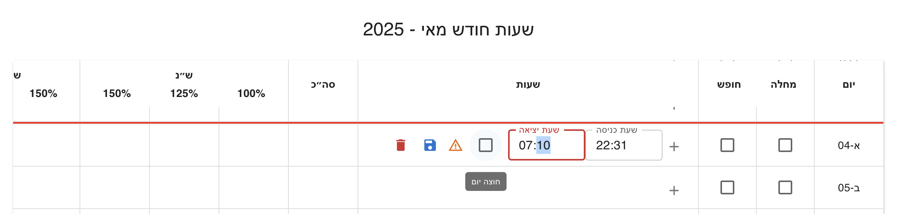

# Shiftly – Work Hours Tracking & Calculation System

A modern work-shift and salary calculator for hourly employees in Israel.

## Features

- Dynamic monthly workday generation with Hebrew calendar integration.
- Calculation of:
  - Regular hours
  - Overtime (125%, 150%)
  - Night and evening additions
  - Shabbat and holiday pay (150%, 200%, 250%, 300%)
  - Sick days and vacation
- Monthly salary summary by hour type
- Based on daily base hours and user-defined hourly wage

## Tech Stack

- **React + TypeScript**
- **Material UI (MUI)**
- **Bootstrap**
- **Vite**
- **Custom hooks and modular logic separation**
- **[Hebcal API](https://www.hebcal.com/home/developer-apis)** for holidays

## Installation

```bash
git clone
cd shiftly
npm install
npm run dev
```

## Project Structure

```plaintext
src/
├── assets/
├── components/
│   ├── BreakdownSummary.tsx
│   ├── ConfigPanel.tsx
│   ├── FooterSummary.tsx
│   ├── MonthlySalarySummary.tsx
│   ├── WorkDayRow.tsx
│   └── WorkTable.tsx
├── hooks/
│   ├── useSegments.ts
│   └── useWorkDays.ts
├── models/
│   └── work_day_row.ts
├── utility/
│   ├── breakdownUtil.ts
│   └── workDayBreakdown.ts
├── App.tsx
├── main.tsx
└── vite-env.d.ts
```

## Interface Preview

### Workday Overview

- If `baseRate` is **not set**: only worked hours are displayed per day in the monthly summary. No daily wage (שכר יומי) or salary table is shown.
- If `baseRate` is **set**: each day includes a daily wage (שכר יומי) and a monthly summary appears below the table.

### Day Configuration Logic

**Shabbat or Holiday - Work Hours Allowed**

- Cannot mark as Sick/Vacation, but work segments are allowed.
  
  

**Friday or Holiday Eve - Sick/Vacation or Work**

- Can mark as Sick/Vacation, or add work hours.
  
  

**Sick Day Or Vacation Day - Not Work Segments**

- Marked as Sick/Vacation; nor work segments allowed.
  
  

**Cross-Day Shift - "חוצה יום" Checkbox**

- End time is next day; system asks to confirm crossing day.
  
  
  

## Custom Hooks

- `useWorkDays`:

  Dynamically generates the list of days in the selected month, with logic for:

  - Shabbat
  - Holiday eve
  - Paid holidays
  - Marking the day before as specialNextDay

  Uses [Hebcal API](https://www.hebcal.com/home/developer-apis) to fetch Hebrew calendar events.

- `useSegments`

  Manages work time segments for each day:

  - Add / update / remove segments (start and end times)
  - Uses minute-based calculations for precise work time handling

## User Interface

- **Top Config Panel**: select year, month, hourly wage, and base daily hours.
- **Work Table**: shows each day, with checkboxes for vacation/sick and option to add work segments.
- **Monthly Summary**: final calculated salary broken down by hour types.

## Calculation Logic Summary

- Regular day:
  - 06:00–14:00 → 100%
  - 14:00–22:00 → 120%
  - 22:00–06:00 → 150%
- Friday / Holiday Eve:
  - Until 17:00/18:00 → Regular
  - After → 250% (150% + 100%)
- Shabbat / Holiday:
  - 06:00–22:00 → 250%
  - 22:00–06:00 → 300%
