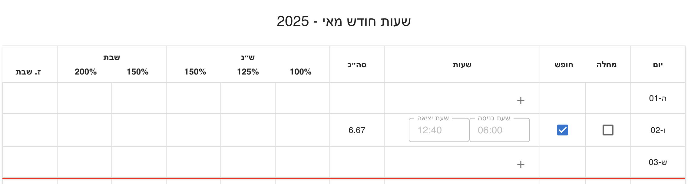

<div dir="rtl">

# Shiftly - מערכת לניהול שעות וחישוב שכר

[](https://dmaman86.github.io/shiftly/?utm_source=github&utm_medium=readme)
[](https://deepwiki.com/dmaman86/shiftly)


[](https://github.com/dmaman86/shiftly/actions/workflows/ci.yml)

[](https://codecov.io/gh/dmaman86/shiftly)


> 📘 גרסה באנגלית זמינה כאן: [README.md](./README.md)

מערכת זו היא אפליקציה לניהול שעות עבודה וחישוב שכר מבוססת על **React + TypeScript**.
חישוב שכר כולל משמרות יומיות, ימים מיוחדים, אש״ל, כלכלה וחוקי עבודה מהעולם האמיתי.

הפרויקט שם דגש לא רק על נכונות החישוב, אלא גם על **מידול דומיין ברור, יציבות ארכיטקטונית ותחזוקה ארוכת טווח**.

> ⚠️ המערכת מספקת חישוב אינדיקטיבי בלבד.  
> אין להסתמך על התוצאות לצורכי תלוש שכר רשמי,  
> והן אינן מחליפות חישוב המתבצע על ידי מדור שכר.

---

## מוטיבציה

**Shiftly** נולד מבעיה אמיתית שנצפתה בסביבת עבודה ממשלתית.

עובדים עוקבים אחר שעות העבודה שלהם לפי **משמרות** — בלוק רציף של שעות עם התחלה וסוף ברורים. אבל תלושי השכר הישראליים לא עובדים כך. הם מחושבים לפי **קטעים משוקללים**: מדרגות שעות נוספות שמתאפסות בכל יום, תוספות שבת וחג שנכנסות לתוקף בשעות מסוימות, ותוספות לילה שחוצות משמרת באמצעה.

התוצאה היא מקור מתסכול ידוע מראש: עובדים מקבלים תלוש שכר שאין להם דרך מעשית לאמת, ואין כלי פשוט שיסביר מאיפה הגיעו המספרים.

**Shiftly** גושר על הפער הזה. הוא מקבל קלט של משמרות בצורה שבה עובדים באמת חושבים — ומחשב את התגמול לפי חוקי העבודה הישראליים: מדרגות שעות נוספות, תוספות שבת וחג, ותוספות לילה — כדי להפוך את החישוב **לשקוף וניתן לאימות** עבור מי שמקבל את התלוש.

---

## עיקרון תכנוני מרכזי

העיקרון המרכזי מאחורי Shiftly הוא ש**לוגיקת החישוב נשארת יציבה לאורך זמן**.

חוקי השכר אינם משתנים לפי מימוש, אלא לפי **הקשר תקופתי**.
תאריכים, שעון קיץ/חורף, שכר שעתי, אש״ל וכלכלה מוגדרים כקלטים ולא כלוגיקה מקודדת.

גישה זו מאפשרת **חישוב לאחור של חודשים קודמים** באמצעות אותו שלד חישוב, רק עם פרמטרים תקופתיים שונים - ללא שינוי בקוד הדומיין.

---

## יכולות עיקריות

- חישוב שכר מבוסס משמרות
- תמיכה ב:
  - ימי עבודה רגילים
  - ימים מיוחדים חלקיים (למשל ימי שישי וערבי חג)
  - ימים מיוחדים מלאים (שבת, חגים)
- **זיהוי חגים באמצעות API של Hebcal**
  - פתרון אוטומטי של חגים יהודיים
  - הבחנה בין ימים מיוחדים מלאים לימים מיוחדים חלקיים
- ימי מחלה וחופשה
- משמרות החוצות יום
- חישוב אש״ל לפי ציר זמן היסטורי
- חישוב כלכלה (קטנה / גדולה)
- פירוט חודשי מצטבר
- חישוב אינקרמנטלי (הוספה / עדכון / הסרה של משמרות)
- ממשק משתמש ריאקטיבי לחלוטין
- התחברות אופציונלית עם Google ושמירת נתונים בין מכשירים

---

## אימות ושמירת נתונים

Shiftly פועלת במלואה **גם ללא חשבון** — הכל רץ בזיכרון, ושום דבר לא נשמר.

התחברות עם **חשבון Google** (דרך Supabase Auth) שומרת בנוסף את הנתונים שלך ב-Supabase, מקושרים לחשבון שלך, כך שהם נשארים זמינים בין הפעלות ובין מכשירים:

- **הגדרות חודשיות** — שנה, חודש, שעות תקן, שכר שעתי
- **סטטוס יום** — סימון מחלה / חופשה לכל יום
- **משמרות** — שעת התחלה, סיום ודגל תפקיד לכל משמרת שנשמרה
- **העברת זכות שבת** — שעות זכות שבת שלא נוצלו עוברות לחודש הבא במקום להיעלם

| טבלה | שומרת |
| --- | --- |
| `monthly_configs` | הגדרות לכל (משתמש, שנה, חודש), וגם יתרת זכות השבת המועברת |
| `work_days` | סטטוס לכל (משתמש, תאריך) (`sick` / `vacation`) — שורה חסרה משמעה `normal` |
| `shifts` | משמרות שנשמרו לכל משתמש, עם התאריך על כל שורה לצורך שאילתות ישירות |

שלוש הטבלאות מוגנות באמצעות Row Level Security של Postgres: כל משתמש יכול לקרוא ולכתוב רק את השורות שלו. הסכמה נמצאת ב-`supabase/migrations/`.

נתוני טבלת העבודה של משתמש מחובר נטענים באמצעות TanStack Query, עם מפתח מטמון המופרד לפי משתמש, שנה וחודש. העריכה זמינה רק לאחר השלמת הטעינה הראשונית, ובמקרה של כשל מוצגת פעולה מפורשת לניסיון חוזר. מעבר בין חשבונות מאפס את מצב העריכה לפני טעינת נתוני החשבון הבא.

הסיכום החודשי טוען ישירות את המשמרות ואת סטטוסי הימים השמורים כאשר השנה והחודש שנבחרו משתנים, ולכן אינו תלוי במעבר מוקדם לתצוגה היומית.

שינויים תקינים במשמרת נשמרים לאחר השהיה קצרה. פעולות כתיבה עבור אותו משתמש ואותו יום מתבצעות לפי הסדר, כדי שעדכון מאוחר לא יעקוף מחיקה שבוצעה אחריו. טיוטות עם שעות לא תקינות נשארות מקומיות עד לתיקונן.

---

## סקירת ארכיטקטורה

Shiftly מבוססת על עקרונות **Clean Architecture**, עם הפרדה ברורה בין לוגיקה עסקית, ממשק משתמש, ניהול מצב ושירותים חיצוניים.

המטרה היא לשמור על לוגיקת הדומיין **צפויה, ניתנת לבדיקה ובלתי תלויה בפריימוורקים**.

### זרימת חישוב כללית

משמרת -> יום -> חודש

כל רמה מחושבת בנפרד ומצטברת באופן דטרמיניסטי.

---

## שכבות מערכת

### דומיין

שכבת הדומיין מכילה לוגיקה עסקית טהורה ואינה תלויה ב-React, בניהול המצב או בספריות חיצוניות.

- **Builders**
  בניית מבני נתונים מורכבים ללא חוקים עסקיים.

- **Calculators**
  פונקציות טהורות ונטולות תלויות המממשות חוקי שכר, אחוזי מקטעים מבוססי זמן, וחיפוש תעריפים מבוסס ציר זמן.

- **Reducers**
  צבירה וביטול צבירה של נתונים מחושבים, המאפשרים חישוב אינקרמנטלי.

- **Resolvers**
  שירותי החלטה מרובי-מתודות (סיווג סוג יום, חודשים זמינים) שאינם מצטמצמים לחישוב יחיד של קלט/פלט.

- **Composition**
  חיבור מרכזי של רכיבי הדומיין דרך `pipelines/`.

### Adapters

המרת אובייקטי דומיין למודלי תצוגה עבור ה-UI, תוך שמירה על ניתוק מלא מהדומיין.

### Hooks

שכבת תיאום דקה בין ה-UI, הדומיין וה-state.
אינה מכילה לוגיקה עסקית.

### ניהול מצב

- **Zustand** מנהל את הגדרות התקופה הגלובליות ואת מפות השכר היומיות
- **React Context** מחזיק אימות, הזרקת תלויות, גבולות אינטגרציה ואת מצב העריכה הנוכחי של טבלת העבודה
- **TanStack Query** מתאם קריאות וכתיבות מאומתות של טבלת העבודה מול Supabase
- מפות השכר היומיות מתעדכנות לפי תאריך, והפירוט החודשי נגזר באופן דטרמיניסטי מהמפות הנוכחיות

מצב Zustand גלובלי:

- `src/store/globalStore.ts`
- `src/store/globalBreakdown.ts`

### רכיבי UI

רכיבי תצוגה בלבד.
ה-UI מגיב לנתונים מחושבים ואינם מכיל חוקי שכר.

---

## מושגי דומיין

### Builders

אחראים להרכבת מבני דומיין:

- `ShiftMapBuilder`
- `ShiftSegmentBuilder`
- `DayPayMapBuilder`
- `WorkDaysForMonthBuilder`

### Calculators

לוגיקת חישוב טהורה מאורגנת לפי תחום:

- **שעות רגילות**: לפי משמרת / יום
- **מקטעים נוספים ומיוחדים**: תוספות מבוססות זמן
- **מקטעי משמרת**: פירוק אחוזי תעריף לפי שעה ביום וסטטוס שבת
- **אש״ל**: רמות משמרת / יום / חודש, עם חיפוש תעריף מבוסס ציר זמן
- **כלכלה**: חישוב זכאות ותעריף, עם חיפוש תעריף מבוסס ציר זמן
- **מקטעים קבועים**: מחלה, חופשה וזכות שבת שנצברה
- **סיווג סוג יום לפי חג**: מבוסס Hebcal

#### מונחים עבור זכות שבת

זכות שבת מיוצגת באמצעות שני ערכים נפרדים, משום שצבירת הזכות והשימוש בה הם אירועים עסקיים שונים:

- `earnedShabbatCredit` הוא הקרדיט שנצבר מעבודה בשבת או בחג. הוא נשמר במפות השכר היומיות והחודשיות של הדומיין ומהווה את מאגר הזכות החודשי.
- `appliedShabbatCredit` הוא החלק מתוך המאגר החודשי שהוקצה להשלמת חוסרי שעות. הוא קיים במודלי התצוגה, ורק הוא נכלל בסך השעות ובחישוב השכר.

המאגר החודשי יכול להשלים ימים ללא עבודה או ימים שבהם בוצעו פחות משעות התקן, כאשר סוג היום הוא `Regular` או `SpecialPartialStart`, ללא תלות במועד שבו הזכות נצברה במהלך החודש. ניתן להשלים כל יום עד שעות התקן שהוגדרו עבורו בלבד. החלוקה מתבצעת בסדר כרונולוגי כדי לשמור על תוצאה דטרמיניסטית וניתנת לבקרה.

יתרה שלא הוקצתה מוצגת כזכות שבת שלא נוצלה:

```text
unusedShabbatCredit = earnedShabbatCredit - appliedShabbatCredit
actualHours = worked hours
totalHours = worked hours + sick hours + vacation hours + appliedShabbatCredit
```

זכות שלא נוצלה מוצגת למשתמש, אך אינה נכללת בסך השעות או בחישוב השכר.

### Reducers

צבירה והפחתה של נתונים:

- Reducer חודשי למפת שכר
- צובר שעות רגילות
- Reducer חודשי למקטעים קבועים
- Reducer חודשי לאש״ל
- Reducer חודשי לימי עבודה

### Resolvers

שירותי החלטה מרובי-מתודות שאינם מצטמצמים לחישוב יחיד של קלט/פלט:

- Resolver חודש — חודשים זמינים וחודש ברירת מחדל לשנה נתונה
- Resolver מידע יום עבודה — שאילתות סוג יום והמשכיות בין ימים

### Services

כלי שירות ברמת הדומיין:

- `DateService`: טיפול ואימות תאריכים
- `ShiftService`: לוגיקה עסקית הקשורה למשמרות

### Pipelines

צינורות הרכבה לחיבור רכיבי דומיין:

- `buildCoreServices`: שירותי תאריך ומשמרת
- `buildResolvers`: מופעי Resolver חודש ומידע יום עבודה
- `buildRateCalculators`: מחשבוני חגים, תעריף אש״ל ותעריף כלכלה
- `buildCalculators`: מופעי Calculators
- `buildShiftLayer`: לוגיקה ברמת משמרת
- `buildDayLayer`: צבירה ברמת יום
- `buildMonthLayer`: צבירה ברמת חודש

---

## טכנולוגיות

### ליבה

- **React** 19.2.3
- **TypeScript** 5.7.2
- **Vite** 8

### State וניווט

- **Zustand** 5.0.15 (מצב גלובלי בצד הלקוח)
- **TanStack Query** 5 (סנכרון מצב שרת עבור משתמשים מחוברים)
- **React Router** 7

### UI ועיצוב

- **Material UI (MUI)** 7.0.2
- **Notistack** 3.0.2 (התראות)

### נתונים ושירותים

- **Axios** 1.18.1 (HTTP client)
- **date-fns** 4.1.0 (טיפול בתאריכים)
- **Hebcal API** (זיהוי חגים)
- **Supabase** 2.112.4 (התחברות Google + שמירת נתונים ב-Postgres)

### בדיקות

- **Vitest** 4
- **Testing Library** (React, Jest-DOM, User Event)

---

## מבנה הפרויקט

```plaintext
.
├── .github/
│   ├── assets/                 # צילומי מסך לקובצי README
│   └── workflows/              # CI, בדיקות pull request ופריסה
├── src/
│   ├── adapters/               # מתאמי מידע חיצוני והמרה מהדומיין לתצוגה
│   ├── app/                    # שורש ההרכבה של האפליקציה
│   │   ├── domain/             # מופע הדומיין וטיפוסים לשכבת האפליקציה
│   │   ├── providers/          # ספקי אימות, כיוון, דומיין והתראות
│   │   └── routes/             # ניתוב האפליקציה וניתוב מותאם שפה
│   ├── constants/              # קבועי דומיין וממשק משותפים
│   ├── domain/                 # כללי שכר בלתי תלויים בפריימוורק
│   │   ├── builder/            # בניית מבני משמרת, יום וחודש
│   │   ├── calculator/         # חישובים רגילים, מיוחדים, מקטעים, תעריפים וזכויות
│   │   ├── pipelines/          # הרכבת תלויות הדומיין
│   │   ├── reducer/            # צבירה חודשית והפחתה
│   │   ├── resolve/            # שירותי החלטה מרובי-מתודות (סוג יום, חודש)
│   │   ├── services/           # שירותי תאריך ומשמרת
│   │   └── types/              # חוזי דומיין ומבני מידע
│   ├── features/               # ממשק ותיאום בבעלות כל פיצ'ר
│   │   ├── auth/               # פקדי התחברות Google
│   │   ├── calculation-rules/  # כללים ודוגמת חישוב אינטראקטיבית
│   │   ├── config/             # פרמטרי עבודה ושמירת תצורה חודשית
│   │   ├── feedback/           # התראות משוב למשתמש
│   │   ├── info-dialog/        # חלונית מידע על האפליקציה
│   │   ├── salary-summary/     # רכיבי שכר חודשי, hooks ומודלי תצוגה
│   │   ├── work-table/         # עריכת ימים ומשמרות רספונסיבית וסנכרון שמירה
│   │   └── workday-timeline/   # ציר זמן חזותי למשמרות
│   ├── hooks/                  # React hooks משותפים לאינטגרציה
│   ├── i18n/                   # משאבי עברית/אנגלית וזיהוי שפה מהכתובת
│   ├── layout/                 # פריסת האפליקציה וגבולות שגיאה
│   ├── pages/                  # עמודים יומיים, חודשיים וכללי חישוב
│   ├── store/                  # מצב גלובלי באמצעות Zustand וחישובי פירוט
│   ├── services/               # לקוחות Analytics, Hebcal ושמירת Supabase
│   ├── test/                   # בדיקות דומיין, store, שירותים וממשק
│   └── utils/                  # טיפול בתוצאות API וכלי עזר משותפים
└── supabase/
    ├── functions/               # Edge Functions מאומתות
    └── migrations/              # סכמת Postgres ומדיניות Row Level Security
```

---

## התנהגות ממשק המשתמש

## תצוגות מערכת

Shiftly כוללת שתי תצוגות חישוב עיקריות:

### תצוגה יומית

- מיועדת להזנת משמרות יומיות
- מאפשרת הוספה, עריכה ובקרה של משמרות
- מציגה פירוק שכר יומי
- הסיכום החודשי מתעדכן באופן אינקרמנטלי

### תצוגה חודשית

- מיועדת לניתוח שכר חודשי מצטבר
- מחייבת בחירת שנה וחודש
- מבטיחה דיוק תעריפי אש״ל וכלכלה לפי התקופה
- טוענת את המשמרות ואת סטטוסי הימים השמורים לתקופה שנבחרה באופן עצמאי מהתצוגה היומית
- מציגה סיכום חודשי קומפקטי וברור

שתי התצוגות משתמשות באותו מנגנון חישוב דומיין.
רק ההקשר וההצגה משתנים.

### פאנל הגדרות (ConfigPanel)

רכיב ה־`ConfigPanel` מותאם להקשר הפעיל:

- **בתצוגה יומית**:
  - הגדרת שעות תקן ושכר שעתי
  - החישוב החודשי נגזר מהנתונים היומיים

- **בתצוגה חודשית**:
  - בחירת שנה וחודש היא הכרחית
  - מבטיחה תעריפי אש״ל וכלכלה מדויקים לפי התקופה
  - מחייבת הגדרת שכר שעתי לצורך חישוב

הפרדה זו מונעת חישוב שגוי ומחדדת אחריות.

### תצוגת יום עבודה

- אם `baseRate` **לא הוגדר**: מוצגות רק שעות העבודה.
- אם `baseRate` **הוגדר**: מוצג שכר יומי וסיכום חודשי.
- **ימי מחלה / חופשה**: לא מאפשרים הזנת משמרות.
- **שבת / חג**: מאפשרים עבודה בלבד (ללא היעדרות).
- **משמרת חוצה יום**: דורשת אישור מפורש מהמשתמש.

### לוגיקת הגדרת יום עבודה

**שבת או חג - עבודה מותרת**

- לא ניתן לסמן יום כמחלה או חופש, אך ניתן להזין משמרות עבודה.
  

**יום מחלה או חופש - ללא משמרות עבודה**

- כאשר יום מסומן כמחלה או חופש, לא ניתן להזין בו משמרות עבודה.
  
  

**משמרת חוצה יום - תיבת סימון ״חוצה יום״**

- כאשר שעת הסיום היא ביום הבא המערכת מבקשת אישור מפורש על חציית יום.
  
  

**סיכום פירוט יומי - תצוגת מחשב**

|                                 פרטים סגורים                                  |                                 פרטים מורחבים                                  |
| :----------------------------------------------------------------------------: | :-----------------------------------------------------------------------------: |
|  |  |

**סיכום פירוט יומי - תצוגת מובייל**

|                                פרטים סגורים                                 |                                פרטים מורחבים                                 |
| :---------------------------------------------------------------------------: | :----------------------------------------------------------------------------: |
|  |  |

**סיכום חודשי**


---

## למה ארכיטקטורה זו?

הארכיטקטורה נבחרה כדי להתמודד עם:

- חוקי שכר מורכבים
- מקרי קצה מבוססי זמן
- רמות צבירה שונות (משמרת → יום → חודש)
- חישוב אינקרמנטלי ללא חישוב מחדש מלא
- דיוק היסטורי ללא שינוי בלוגיקה הליבה

היא מאפשרת התפתחות עתידית של המערכת **בלי להעמיס לוגיקה מותנית ברכיבי ה-UI**.

---

## הערות מימוש

- כל האחוזים מנורמלים (לדוגמה: `1` = 100%, `1.5` = 150%, `2` = 200%)
- לוגיקת הדומיין בלתי תלויה בפריימוורק וניתנת לבדיקה באופן מלא
- ה־UI מגיב לנתונים ולא מכיל חוקים עסקיים
- חישובים היסטוריים משתמשים בהקשר מבוסס זמן, לא בשינויי קוד

---

## בדיקות

Shiftly משתמשת ב־**Vitest** לבדיקות יחידה ואינטגרציה, עם דגש על אימות לוגיקת הדומיין.

### הרצת בדיקות

```bash
# הרצת בדיקות במצב watch
bun run test

# הרצת בדיקות עם ממשק UI
bun run test:ui

# הרצת בדיקות עם כיסוי קוד
bun run test:coverage

# הרצת בדיקות במצב CI (הרצה חד־פעמית)
bun run test:ci
```

### בדיקות איכות ובניית גרסת Production

```bash
# בדיקת טיפוסים של האפליקציה ושל הגדרות Vite
bun run typecheck

# הרצת ניתוח סטטי
bun run lint

# יצירת חבילת production בתיקייה dist/
bun run build
```

### כיסוי בדיקות

הבדיקות מכסות:

- לוגיקת חישוב (builders, calculators, reducers)
- פתרונות מבוססי זמן (חגים, תעריפים, מקטעים)
- מקרי קצה (משמרות חוצות יום, ימים חלקיים, מחלה/חופשה)
- תרחישי חישוב מקצה לקצה

שכבת הדומיין ניתנת לבדיקה באופן מלא ובלתי תלויה בפריימוורק, מה שמקל על אימות חוקים עסקיים בבידוד.

---

## התחלה מהירה

Shiftly תומכת ב־Node.js 24 וב־Bun 1.3.14 ומעלה בסדרת 1.x. גרסת Node.js המדויקת של ה־CI מוגדרת בקובץ `.nvmrc`, וגרסת Bun מוגדרת ב־`package.json`.

```bash
git clone https://github.com/dmaman86/shiftly.git
cd shiftly
nvm install
nvm use
bun install --frozen-lockfile
bun run dev
```

כניסה ל־`http://localhost:5173/shiftly` בדפדפן.

### הגדרת Supabase (אופציונלי)

מצב אורח עובד בלי שום הגדרה — שום דבר לא נשמר, ואין צורך בחשבון.

כדי להפעיל התחברות עם Google ושמירת נתונים בין מכשירים, צרו קובץ `.env.local` עם פרטי הפרויקט שלכם ב-Supabase:

```bash
VITE_SUPABASE_URL=
VITE_SUPABASE_PUBLISHABLE_KEY=
```

לאחר מכן הריצו את קבצי ה-SQL תחת `supabase/migrations/`, לפי הסדר, ב-SQL Editor של פרויקט ה-Supabase שלכם, כדי ליצור את הטבלאות `monthly_configs`, `work_days` ו-`shifts` עם מדיניות ה-Row Level Security שלהן.

מחיקת חשבון דורשת את Supabase Edge Function בשם `delete-account`, כי מחיקה מ-`auth.users` דורשת מפתח סודי בצד שרת. לאחר קישור הפרויקט, פרסו אותה כך:

```bash
supabase functions deploy delete-account
```

הפונקציה מאמתת את ה-JWT של המשתמש המחובר ומוחקת את אותו משתמש מ-Supabase Auth. מאחר שהטבלאות משתמשות ב-`on delete cascade`, הרשומות של המשתמש ב-`monthly_configs`, `work_days` ו-`shifts` נמחקות על ידי בסיס הנתונים.

---

## רישיון

הפרויקט מופץ תחת רישיון [MIT](LICENSE).

</div>
