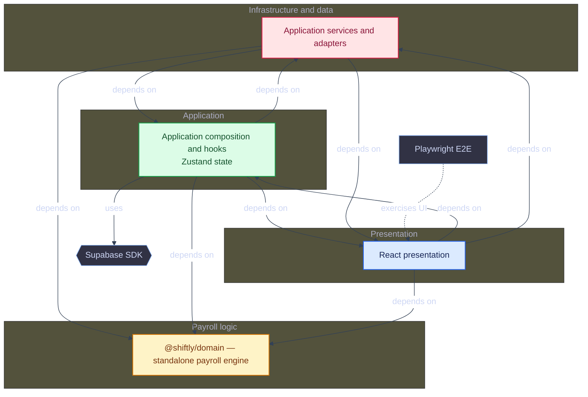

# Shiftly – Work Hours Tracking & Calculation System

> 📘 Hebrew version available: [README_HE.md](./README_HE.md)

**Shiftly** is a work-hours tracking and salary calculation application built with **React + TypeScript**.
It is designed to accurately calculate monthly salary based on daily shifts, special days, per-diem rules, and the rules applied in government offices.

The project focuses not only on correctness, but on **clear domain modeling, architectural stability, and long-term maintainability**.

> ⚠️ This system provides **indicative calculations only**.  
> The results should not be used for official payroll purposes  
> and do not replace calculations performed by an authorized payroll department.

---

## Motivation

Shiftly was born from a real problem observed in a government office.

Workers track time in shifts: a continuous block of hours with a clear start and end. Israeli payslips don't work that way. They are computed in weighted segments: overtime brackets that restart with each working day, Shabbat and holiday additions that begin at specific hours, and night additions that cut through the middle of a shift.

The result is a predictable frustration: employees get a payslip they have no practical way to verify. Shiftly bridges that gap. You enter shifts the way you think about them, and it calculates pay by the rules applied in government offices, so every amount can be inspected and explained.

---

## Core Design Principles

The core principle behind Shiftly is that **calculation logic remains stable over time**.

Salary rules do not change per implementation, but per **period context**.
Calendar dates, hourly rates, per-diem rules, and allowances are treated as inputs rather than hardcoded UI behavior.

For partial special days, the start of the special-rate period follows the current business rule: **18:00 from April through September and 17:00 from October through March**. Dates are accepted only in `YYYY-MM-DD` format and are validated as real calendar dates.

This makes it possible to **recalculate past months accurately** using the same calculation pipeline, simply by changing the contextual parameters - without modifying domain code.

---

## Features

- Shift-based salary calculation
- Support for:
  - Regular workdays
  - Partial special days (e.g. Fridays, holiday eves)
  - Full special days (Shabbat, holidays)
- **Holiday detection via Hebcal API**
  - Automatic resolution of Jewish holidays
  - Differentiation between full and partial special days
- Sick days & vacation days
- Cross-day shifts
- Per-diem calculation with historical rate timeline
- Meal allowance calculation (small / large)
- Optional hourly-rate calculation: when `baseRate > 0`, the daily pay column and salary summary are shown; clearing it or setting it to `0` hides them
- Monthly aggregated breakdown
- Monthly totals recomputed from the current daily pay maps after adding, updating, or removing shifts
- Fully reactive UI
- Landscape, right-to-left PDF export with weekly separators, independent meal-allowance columns, per-page metadata, and the application copyright footer
- Optional Google sign-in with cross-device data persistence
- Authenticated profile with an account card and three historical charts, sharing preset or custom monthly ranges

---

## Authentication & Data Persistence

The salary calculators work **without an account** — calculation data stays in memory. The personal profile and persisted history require authentication.

Signing in with a **Google account** (via Supabase Auth) additionally persists your data to Supabase, tied to your account, so it carries over across sessions and devices:

- **Monthly configuration** — year, month, standard hours, hourly rate
- **Day status** — sick / vacation marks per day
- **Shifts** — start, end, and duty flag for each saved shift
- **Shabbat credit carry-over** — unused Shabbat credit hours roll forward to the next month instead of being lost

| Table             | Stores                                                                               |
| ----------------- | ------------------------------------------------------------------------------------ |
| `monthly_configs` | Per-(user, year, month) settings, plus the running Shabbat-credit carry-over balance |
| `work_days`       | Per-(user, date) status (`sick` / `vacation`) — a missing row means `normal`         |
| `shifts`          | Per-user saved shifts, with the date denormalized onto each row for direct querying  |

All three tables are protected by Postgres Row Level Security: each user can only read or write their own rows. The schema lives in `supabase/migrations/`.

Authenticated work-table data is loaded with TanStack Query using a cache key scoped to the user, year, and month. Editing remains unavailable until that initial snapshot is ready, and a failed load presents an explicit retry action. Changing accounts resets the editable state before loading the next account's data.

The monthly summary hydrates persisted shifts and day statuses directly when its selected year and month change, so it does not depend on visiting the daily view first.

Valid shift edits are saved after a short debounce. Writes for the same user and day are serialized so a late update cannot overtake a subsequent deletion. Invalid time drafts remain local until they become valid.

---

## Architecture Overview

Shiftly follows a **Clean Architecture–inspired design**, with a strong emphasis on keeping business rules isolated from UI, state management, and external services.

The goal is to ensure that domain logic remains **predictable, testable, and unaffected by framework or UI changes**.

### High-Level Flow

Shiftly does not model work as fixed shift types. It interprets each real
worked timeline and applies rules at the temporal level where they exist:

```text
Raw shifts
    ↓
Timeline classification
    ↓
Regular / Special calculations
    ↓
Daily pay breakdown
    ↓
Monthly aggregation and monthly-only rules
```

The central separation is:

- **Classification** — which category does each worked interval belong to?
- **Calculation** — how should that classified time be compensated?
- **Aggregation** — what is the resulting day and month?

Each stage is deterministic, independently testable, and preserves the
distinction between timeline boundaries and business-rule resets.

### System Overview

<details>
<summary>Overview</summary>



</details>

## Architectural Layers

### Domain

```mermaid
---
config:
  theme: base
  themeVariables:
    background: "#1e1e2e"
    primaryColor: "#313244"
    primaryTextColor: "#cdd6f4"
    primaryBorderColor: "#89b4fa"
    lineColor: "#334155"
    edgeLabelBackground: "#ffffff"
---
%% Source: main (HEAD). Module dependencies include type imports. Commit: 2f6d26699aa360b6758154d1ebc0bb23d53807fe.
%% Barrel re-exports are resolved; arrows point from consumers to dependencies.
flowchart TD
  subgraph group_domain["Payroll logic"]
    node_0["composition<br/>[packages/domain/src/composition.ts]"]
    node_1["buildDayLayer.pipeline<br/>[packages/domain/src/pipelines/buildDayLayer.pipeline.ts]"]
    node_2["buildResolvers.pipeline<br/>[packages/domain/src/pipelines/buildResolvers.pipeline.ts]"]
    node_3["buildMonthLayer.pipeline<br/>[packages/domain/src/pipelines/buildMonthLayer.pipeline.ts]"]
    node_4["buildCalculators.pipeline<br/>[packages/domain/src/pipelines/buildCalculators.pipeline.ts]"]
    node_5["buildCoreServices.pipeline<br/>[packages/domain/src/pipelines/buildCoreServices.pipeline.ts]"]
    node_6["shiftmap.builder<br/>[packages/domain/src/builder/shiftmap.builder.ts]"]
    node_7["daypaymap.builder<br/>[packages/domain/src/builder/daypaymap.builder.ts]"]
    node_8["workdaysformonth.builder<br/>[packages/domain/src/builder/workdaysformonth.builder.ts]"]
    node_9["timeline-shift-pay.calculator<br/>[packages/domain/src/calculator/timeline-shift-pay.calculator.ts]"]
    node_10["classify-shift-timeline<br/>[packages/domain/src/timeline/classify-shift-timeline.ts]"]
    node_11["month-pay-map.reducer<br/>[packages/domain/src/reducer/month-pay-map.reducer.ts]"]
    node_12["workdayinfo.resolver<br/>[packages/domain/src/resolve/workdayinfo.resolver.ts]"]
    node_13["date.service<br/>[packages/domain/src/services/date.service.ts]"]
    node_14["shift.service<br/>[packages/domain/src/services/shift.service.ts]"]
    node_15["perdiem-month.reducer<br/>[packages/domain/src/reducer/perdiem-month.reducer.ts]"]
    node_16["workday-month.reducer<br/>[packages/domain/src/reducer/workday-month.reducer.ts]"]
    node_17["fixed-segment-month.reducer<br/>[packages/domain/src/reducer/fixed-segment-month.reducer.ts]"]
    node_18["meal-allowance-month.reducer<br/>[packages/domain/src/reducer/meal-allowance-month.reducer.ts]"]
    node_19["buildShiftLayer.pipeline<br/>[packages/domain/src/pipelines/buildShiftLayer.pipeline.ts]"]
  end
  node_0 -->|"depends on"| node_4
  node_0 -->|"depends on"| node_5
  node_0 -->|"depends on"| node_1
  node_0 -->|"depends on"| node_3
  node_0 -->|"depends on"| node_2
  node_0 -->|"depends on"| node_19
  node_1 -->|"depends on"| node_7
  node_1 -->|"depends on"| node_8
  node_2 -->|"depends on"| node_12
  node_3 -->|"depends on"| node_17
  node_3 -->|"depends on"| node_18
  node_3 -->|"depends on"| node_11
  node_3 -->|"depends on"| node_15
  node_3 -->|"depends on"| node_16
  node_5 -->|"depends on"| node_13
  node_5 -->|"depends on"| node_14
  node_6 -->|"depends on"| node_14
  node_6 -->|"depends on"| node_13
  node_6 -->|"depends on"| node_10
  node_6 -->|"depends on"| node_9
  node_8 -->|"depends on"| node_12
  node_8 -->|"depends on"| node_13
  node_10 -->|"depends on"| node_13
  node_11 -->|"depends on"| node_17
  node_11 -->|"depends on"| node_18
  node_11 -->|"depends on"| node_16
  node_14 -->|"depends on"| node_13
  node_19 -->|"depends on"| node_6
  node_19 -->|"depends on"| node_9
  click node_0 "https://github.com/dmaman86/shiftly/blob/main/packages/domain/src/composition.ts"
  click node_1 "https://github.com/dmaman86/shiftly/blob/main/packages/domain/src/pipelines/buildDayLayer.pipeline.ts"
  click node_2 "https://github.com/dmaman86/shiftly/blob/main/packages/domain/src/pipelines/buildResolvers.pipeline.ts"
  click node_3 "https://github.com/dmaman86/shiftly/blob/main/packages/domain/src/pipelines/buildMonthLayer.pipeline.ts"
  click node_4 "https://github.com/dmaman86/shiftly/blob/main/packages/domain/src/pipelines/buildCalculators.pipeline.ts"
  click node_5 "https://github.com/dmaman86/shiftly/blob/main/packages/domain/src/pipelines/buildCoreServices.pipeline.ts"
  click node_6 "https://github.com/dmaman86/shiftly/blob/main/packages/domain/src/builder/shiftmap.builder.ts"
  click node_7 "https://github.com/dmaman86/shiftly/blob/main/packages/domain/src/builder/daypaymap.builder.ts"
  click node_8 "https://github.com/dmaman86/shiftly/blob/main/packages/domain/src/builder/workdaysformonth.builder.ts"
  click node_9 "https://github.com/dmaman86/shiftly/blob/main/packages/domain/src/calculator/timeline-shift-pay.calculator.ts"
  click node_10 "https://github.com/dmaman86/shiftly/blob/main/packages/domain/src/timeline/classify-shift-timeline.ts"
  click node_11 "https://github.com/dmaman86/shiftly/blob/main/packages/domain/src/reducer/month-pay-map.reducer.ts"
  click node_12 "https://github.com/dmaman86/shiftly/blob/main/packages/domain/src/resolve/workdayinfo.resolver.ts"
  click node_13 "https://github.com/dmaman86/shiftly/blob/main/packages/domain/src/services/date.service.ts"
  click node_14 "https://github.com/dmaman86/shiftly/blob/main/packages/domain/src/services/shift.service.ts"
  click node_15 "https://github.com/dmaman86/shiftly/blob/main/packages/domain/src/reducer/perdiem-month.reducer.ts"
  click node_16 "https://github.com/dmaman86/shiftly/blob/main/packages/domain/src/reducer/workday-month.reducer.ts"
  click node_17 "https://github.com/dmaman86/shiftly/blob/main/packages/domain/src/reducer/fixed-segment-month.reducer.ts"
  click node_18 "https://github.com/dmaman86/shiftly/blob/main/packages/domain/src/reducer/meal-allowance-month.reducer.ts"
  click node_19 "https://github.com/dmaman86/shiftly/blob/main/packages/domain/src/pipelines/buildShiftLayer.pipeline.ts"
  classDef toneAmber fill:#fef3c7,stroke:#d97706,stroke-width:1.5px,color:#78350f
  class node_0,node_1,node_2,node_3,node_4,node_5,node_6,node_7,node_8,node_9,node_10,node_11,node_12,node_13,node_14,node_15,node_16,node_17,node_18,node_19 toneAmber
```

<details>
<summary>Domain</summary>



</details>

The domain layer contains **pure business logic** and is framework-agnostic.

- **Builders**
  Construct domain structures without embedding business rules.

- **Timeline classification**
  Splits arbitrary worked intervals into mutually exclusive `Regular` or
  `Special` categories, including cross-day, holiday, Shabbat, and historical
  calendar boundaries.

- **Calculators**
  Independent pipelines for base hours, dated additions, special hours,
  per-diem, meal allowances, credits, and other domain rules.

- **Reducers**
  Accumulate calculated daily values into a fresh monthly breakdown whenever the daily pay maps change.

- **Resolvers**
  Multi-method decision services (day-type classification, available months) whose shape doesn't reduce to a single input/output calculation.

- **Composition**
  Centralized wiring of domain components via `pipelines/`. The public API is assembled in `packages/domain/src/composition.ts` and exported by `packages/domain/src/index.ts`; the web app imports `@shiftly/domain` and adapts it in `apps/web/src/app/domain/domain.instance.ts`.

### Presentation

```mermaid
---
config:
  theme: base
  themeVariables:
    background: "#1e1e2e"
    primaryColor: "#313244"
    primaryTextColor: "#cdd6f4"
    primaryBorderColor: "#89b4fa"
    lineColor: "#334155"
    edgeLabelBackground: "#ffffff"
---
%% Source: main (HEAD). Module dependencies include type imports. Commit: 2f6d26699aa360b6758154d1ebc0bb23d53807fe.
%% Barrel re-exports are resolved; arrows point from consumers to dependencies.
flowchart TD
  subgraph group_ui["Presentation"]
    node_0["App<br/>[apps/web/src/app/App.tsx]"]
    node_1["AppRoutes<br/>[apps/web/src/app/routes/AppRoutes.tsx]"]
    node_2["DailyPage<br/>[apps/web/src/pages/DailyPage.tsx]"]
    node_3["MonthlySummaryPage<br/>[apps/web/src/pages/MonthlySummaryPage.tsx]"]
    node_4["CalculationRulesPage<br/>[apps/web/src/pages/CalculationRulesPage.tsx]"]
    node_5["WorkTable<br/>[apps/web/src/features/work-table/components/month/WorkTable.tsx]"]
    node_6["GuestModeNotice<br/>[apps/web/src/features/auth/GuestModeNotice.tsx]"]
    node_7["GoogleSignInButton<br/>[apps/web/src/features/auth/GoogleSignInButton.tsx]"]
    node_8["GuestDraftConflictDialog<br/>[apps/web/src/features/guest-draft/GuestDraftConflictDialog.tsx]"]
    node_9["MonthlySalarySummary<br/>[apps/web/src/features/salary-summary/components/MonthlySalarySummary.tsx]"]
  end
  subgraph group_app["Application and state"]
    node_10["useDayController<br/>[apps/web/src/features/work-table/hooks/day/useDayController.ts]"]
  end
  subgraph group_data["Infrastructure and adapters"]
    node_11["dayToPayBreadownVM<br/>[apps/web/src/adapters/dayToPayBreadownVM.ts]"]
    node_12["monthToPayBreakdownVM<br/>[apps/web/src/adapters/monthToPayBreakdownVM.ts]"]
  end
  node_0 -->|"depends on"| node_1
  node_1 -->|"depends on"| node_2
  node_1 -->|"depends on"| node_3
  node_1 -->|"depends on"| node_4
  node_2 -->|"depends on"| node_5
  node_2 -->|"depends on"| node_9
  node_3 -->|"depends on"| node_9
  node_5 -->|"depends on"| node_6
  node_6 -->|"depends on"| node_7
  node_10 -->|"depends on"| node_11
  click node_0 "https://github.com/dmaman86/shiftly/blob/main/apps/web/src/app/App.tsx"
  click node_1 "https://github.com/dmaman86/shiftly/blob/main/apps/web/src/app/routes/AppRoutes.tsx"
  click node_2 "https://github.com/dmaman86/shiftly/blob/main/apps/web/src/pages/DailyPage.tsx"
  click node_3 "https://github.com/dmaman86/shiftly/blob/main/apps/web/src/pages/MonthlySummaryPage.tsx"
  click node_4 "https://github.com/dmaman86/shiftly/blob/main/apps/web/src/pages/CalculationRulesPage.tsx"
  click node_5 "https://github.com/dmaman86/shiftly/blob/main/apps/web/src/features/work-table/components/month/WorkTable.tsx"
  click node_6 "https://github.com/dmaman86/shiftly/blob/main/apps/web/src/features/auth/GuestModeNotice.tsx"
  click node_7 "https://github.com/dmaman86/shiftly/blob/main/apps/web/src/features/auth/GoogleSignInButton.tsx"
  click node_8 "https://github.com/dmaman86/shiftly/blob/main/apps/web/src/features/guest-draft/GuestDraftConflictDialog.tsx"
  click node_9 "https://github.com/dmaman86/shiftly/blob/main/apps/web/src/features/salary-summary/components/MonthlySalarySummary.tsx"
  click node_10 "https://github.com/dmaman86/shiftly/blob/main/apps/web/src/features/work-table/hooks/day/useDayController.ts"
  click node_11 "https://github.com/dmaman86/shiftly/blob/main/apps/web/src/adapters/dayToPayBreadownVM.ts"
  click node_12 "https://github.com/dmaman86/shiftly/blob/main/apps/web/src/adapters/monthToPayBreakdownVM.ts"
  classDef toneBlue fill:#dbeafe,stroke:#2563eb,stroke-width:1.5px,color:#172554
  class node_0,node_1,node_2,node_3,node_4,node_5,node_6,node_7,node_8,node_9 toneBlue
  classDef toneMint fill:#dcfce7,stroke:#16a34a,stroke-width:1.5px,color:#14532d
  class node_10 toneMint
  classDef toneRose fill:#ffe4e6,stroke:#e11d48,stroke-width:1.5px,color:#881337
  class node_11,node_12 toneRose
```

<details>
<summary>Presentation</summary>



</details>

#### Application and UI Types
`apps/web/src/app/` is the application composition root. The web app imports the framework-independent `@shiftly/domain` package and adapts its public API for React. For example, application code calls `domain.payMap.calculateDayFromShifts(...)`.

Domain contracts remain under `packages/domain/src/types`. UI-facing models such as `PayBreakdownViewModel`, `CompactPayBreakdownVM`, and `WorkDayInfo` live under `apps/web/src/app/types`, because they describe presentation and application state rather than domain rules. Adapters and feature mappers convert domain results into those application models.

#### Hooks
Thin orchestration layer between UI, domain, and state.
Hooks coordinate data flow without embedding business logic.

#### UI Components
Pure presentation logic.
UI reacts to data - it does not implement salary rules.
Duty/Meal Allowance shifts are rendered as `Duty` in the English print view and `תפקיד` in the Hebrew print view.

---

### Application

```mermaid
---
config:
  theme: base
  themeVariables:
    background: "#1e1e2e"
    primaryColor: "#313244"
    primaryTextColor: "#cdd6f4"
    primaryBorderColor: "#89b4fa"
    lineColor: "#334155"
    edgeLabelBackground: "#ffffff"
---
%% Source: main (HEAD). Module dependencies include type imports. Commit: 2f6d26699aa360b6758154d1ebc0bb23d53807fe.
%% Barrel re-exports are resolved; arrows point from consumers to dependencies.
flowchart TD
  subgraph group_app["Application and state"]
    node_0["AppProviders<br/>[apps/web/src/app/providers/AppProviders.tsx]"]
    node_1["AuthProvider<br/>[apps/web/src/app/providers/auth/AuthProvider.tsx]"]
    node_2["DomainProvider<br/>[apps/web/src/app/providers/domain/DomainProvider.tsx]"]
    node_3["domain.instance<br/>[apps/web/src/app/domain/domain.instance.ts]"]
    node_4["MonthlyDataProvider<br/>[apps/web/src/features/monthly-data/MonthlyDataProvider.tsx]"]
    node_5["GuestDraftImportProvider<br/>[apps/web/src/features/guest-draft/GuestDraftImportProvider.tsx]"]
    node_6["useGuestDraftCapture<br/>[apps/web/src/features/work-table/hooks/month/useGuestDraftCapture.ts]"]
    node_7["useWorkTableMonthSession<br/>[apps/web/src/features/work-table/hooks/month/useWorkTableMonthSession.ts]"]
    node_8["WorkTableDayStateProvider<br/>[apps/web/src/features/work-table/context/workTableDayState/WorkTableDayStateProvider.tsx]"]
    node_9["globalStore<br/>[apps/web/src/store/globalStore.ts]"]
    node_10["useAuth<br/>[apps/web/src/hooks/useAuth.ts]"]
    node_11["useDomain<br/>[apps/web/src/hooks/useDomain.ts]"]
    node_12["useGlobalState<br/>[apps/web/src/hooks/useGlobalState.ts]"]
    node_13["month.resolver<br/>[apps/web/src/app/months/month.resolver.ts]"]
    node_14["workdayinfo.presenter<br/>[apps/web/src/app/domain/workdayinfo.presenter.ts]"]
  end
  node_0 -->|"depends on"| node_1
  node_0 -->|"depends on"| node_2
  node_2 -->|"depends on"| node_3
  node_3 -->|"depends on"| node_13
  node_3 -->|"depends on"| node_14
  node_4 -->|"depends on"| node_10
  node_4 -->|"depends on"| node_12
  node_4 -->|"depends on"| node_9
  node_5 -->|"depends on"| node_10
  node_5 -->|"depends on"| node_11
  node_5 -->|"depends on"| node_12
  node_7 -->|"depends on"| node_10
  node_7 -->|"depends on"| node_12
  node_7 -->|"depends on"| node_9
  node_7 -->|"depends on"| node_6
  node_12 -->|"depends on"| node_9
  node_1 -->|"imports"| external_supabase
  external_supabase{{"Supabase SDK"}}
  click node_0 "https://github.com/dmaman86/shiftly/blob/main/apps/web/src/app/providers/AppProviders.tsx"
  click node_1 "https://github.com/dmaman86/shiftly/blob/main/apps/web/src/app/providers/auth/AuthProvider.tsx"
  click node_2 "https://github.com/dmaman86/shiftly/blob/main/apps/web/src/app/providers/domain/DomainProvider.tsx"
  click node_3 "https://github.com/dmaman86/shiftly/blob/main/apps/web/src/app/domain/domain.instance.ts"
  click node_4 "https://github.com/dmaman86/shiftly/blob/main/apps/web/src/features/monthly-data/MonthlyDataProvider.tsx"
  click node_5 "https://github.com/dmaman86/shiftly/blob/main/apps/web/src/features/guest-draft/GuestDraftImportProvider.tsx"
  click node_6 "https://github.com/dmaman86/shiftly/blob/main/apps/web/src/features/work-table/hooks/month/useGuestDraftCapture.ts"
  click node_7 "https://github.com/dmaman86/shiftly/blob/main/apps/web/src/features/work-table/hooks/month/useWorkTableMonthSession.ts"
  click node_8 "https://github.com/dmaman86/shiftly/blob/main/apps/web/src/features/work-table/context/workTableDayState/WorkTableDayStateProvider.tsx"
  click node_9 "https://github.com/dmaman86/shiftly/blob/main/apps/web/src/store/globalStore.ts"
  click node_10 "https://github.com/dmaman86/shiftly/blob/main/apps/web/src/hooks/useAuth.ts"
  click node_11 "https://github.com/dmaman86/shiftly/blob/main/apps/web/src/hooks/useDomain.ts"
  click node_12 "https://github.com/dmaman86/shiftly/blob/main/apps/web/src/hooks/useGlobalState.ts"
  click node_13 "https://github.com/dmaman86/shiftly/blob/main/apps/web/src/app/months/month.resolver.ts"
  click node_14 "https://github.com/dmaman86/shiftly/blob/main/apps/web/src/app/domain/workdayinfo.presenter.ts"
  classDef toneMint fill:#dcfce7,stroke:#16a34a,stroke-width:1.5px,color:#14532d
  class node_0,node_1,node_2,node_3,node_4,node_5,node_6,node_7,node_8,node_9,node_10,node_11,node_12,node_13,node_14 toneMint
```

<details>
<summary>Application</summary>



</details>

#### State Management
- **Zustand** handles global period configuration and daily pay maps
- **React Context** owns authentication, dependency injection, UI integration boundaries, and the current work-table editing session
- **TanStack Query** coordinates authenticated work-table reads and writes to Supabase
- Daily pay maps are updated by date key, and the monthly breakdown is derived deterministically from the current maps

Global Zustand state:

- `apps/web/src/store/globalStore.ts`
- `apps/web/src/store/globalBreakdown.ts`

### Data

```mermaid
---
config:
  theme: base
  themeVariables:
    background: "#1e1e2e"
    primaryColor: "#313244"
    primaryTextColor: "#cdd6f4"
    primaryBorderColor: "#89b4fa"
    lineColor: "#334155"
    edgeLabelBackground: "#ffffff"
---
%% Source: main (HEAD). Module dependencies include type imports. Commit: 2f6d26699aa360b6758154d1ebc0bb23d53807fe.
%% Barrel re-exports are resolved; arrows point from consumers to dependencies.
flowchart TD
  subgraph group_data["Infrastructure and adapters"]
    node_0["supabase.crud<br/>[apps/web/src/services/supabase/supabase.crud.ts]"]
    node_1["supabase.client<br/>[apps/web/src/services/supabase/supabase.client.ts]"]
    node_2["shift.service<br/>[apps/web/src/services/shift/shift.service.ts]"]
    node_3["hebcal.service<br/>[apps/web/src/services/hebcal/hebcal.service.ts]"]
    node_4["account.service<br/>[apps/web/src/services/account/account.service.ts]"]
    node_5["workDay.service<br/>[apps/web/src/services/workDay/workDay.service.ts]"]
    node_6["calendar.service<br/>[apps/web/src/services/calendar/calendar.service.ts]"]
    node_7["analytics.service<br/>[apps/web/src/services/analytics/analytics.service.ts]"]
    node_8["guestDraft.service<br/>[apps/web/src/services/guestDraft/guestDraft.service.ts]"]
    node_9["monthlyConfig.service<br/>[apps/web/src/services/monthlyConfig/monthlyConfig.service.ts]"]
    node_10["guestDraft.storage<br/>[apps/web/src/services/guestDraft/guestDraft.storage.ts]"]
    node_11["hebcal.request<br/>[apps/web/src/services/hebcal/hebcal.request.ts]"]
    node_12["gtag<br/>[apps/web/src/services/analytics/gtag.ts]"]
    node_13["event.adapter<br/>[apps/web/src/adapters/event.adapter.ts]"]
    node_14["dayToPayBreadownVM<br/>[apps/web/src/adapters/dayToPayBreadownVM.ts]"]
    node_15["monthToPayBreakdownVM<br/>[apps/web/src/adapters/monthToPayBreakdownVM.ts]"]
  end
  node_0 -->|"depends on"| node_1
  node_2 -->|"depends on"| node_0
  node_3 -->|"depends on"| node_11
  node_4 -->|"depends on"| node_1
  node_5 -->|"depends on"| node_0
  node_8 -->|"depends on"| node_1
  node_8 -->|"depends on"| node_10
  node_9 -->|"depends on"| node_0
  node_10 -->|"depends on"| node_2
  node_10 -->|"depends on"| node_5
  node_1 -->|"imports"| external_supabase
  node_3 -->|"imports"| external_http
  node_6 -->|"imports"| external_http
  node_7 -->|"calls"| external_analytics
  node_12 -->|"calls"| external_analytics
  external_supabase{{"Supabase SDK"}}
  external_http{{"HTTP client (axios)"}}
  external_analytics{{"Google Analytics (gtag)"}}
  click node_0 "https://github.com/dmaman86/shiftly/blob/main/apps/web/src/services/supabase/supabase.crud.ts"
  click node_1 "https://github.com/dmaman86/shiftly/blob/main/apps/web/src/services/supabase/supabase.client.ts"
  click node_2 "https://github.com/dmaman86/shiftly/blob/main/apps/web/src/services/shift/shift.service.ts"
  click node_3 "https://github.com/dmaman86/shiftly/blob/main/apps/web/src/services/hebcal/hebcal.service.ts"
  click node_4 "https://github.com/dmaman86/shiftly/blob/main/apps/web/src/services/account/account.service.ts"
  click node_5 "https://github.com/dmaman86/shiftly/blob/main/apps/web/src/services/workDay/workDay.service.ts"
  click node_6 "https://github.com/dmaman86/shiftly/blob/main/apps/web/src/services/calendar/calendar.service.ts"
  click node_7 "https://github.com/dmaman86/shiftly/blob/main/apps/web/src/services/analytics/analytics.service.ts"
  click node_8 "https://github.com/dmaman86/shiftly/blob/main/apps/web/src/services/guestDraft/guestDraft.service.ts"
  click node_9 "https://github.com/dmaman86/shiftly/blob/main/apps/web/src/services/monthlyConfig/monthlyConfig.service.ts"
  click node_10 "https://github.com/dmaman86/shiftly/blob/main/apps/web/src/services/guestDraft/guestDraft.storage.ts"
  click node_11 "https://github.com/dmaman86/shiftly/blob/main/apps/web/src/services/hebcal/hebcal.request.ts"
  click node_12 "https://github.com/dmaman86/shiftly/blob/main/apps/web/src/services/analytics/gtag.ts"
  click node_13 "https://github.com/dmaman86/shiftly/blob/main/apps/web/src/adapters/event.adapter.ts"
  click node_14 "https://github.com/dmaman86/shiftly/blob/main/apps/web/src/adapters/dayToPayBreadownVM.ts"
  click node_15 "https://github.com/dmaman86/shiftly/blob/main/apps/web/src/adapters/monthToPayBreakdownVM.ts"
  classDef toneRose fill:#ffe4e6,stroke:#e11d48,stroke-width:1.5px,color:#881337
  class node_0,node_1,node_2,node_3,node_4,node_5,node_6,node_7,node_8,node_9,node_10,node_11,node_12,node_13,node_14,node_15 toneRose
```

<details>
<summary>Data</summary>



</details>

#### Adapters
Convert domain objects into UI-friendly view models.
This ensures the domain never depends on presentation concerns.

---
## Domain Concepts

### Builders

Responsible for assembling domain structures:

- `ShiftMapBuilder`
- `DayPayMapBuilder`
- `WorkDaysForMonthBuilder`

`DefaultShiftMapBuilder` normalizes each valid shift into one continuous timeline
and passes it to `TimelineShiftPayCalculator`. Crossing midnight is therefore a
timeline concern, not a separate salary-calculation case.

### Calculators

Pure calculation logic organized by concern:

- **Timeline classification**: Regular/Special intervals with calendar identity
- **Base hours**: configurable 100% → 125% → 150% progression without boundary resets
- **Additions**: date-based evening/night policy, including the three-hour qualification
- **Special hours**: independent 150%/200% classification
- **Per-diem**: timeline-based rates and daily calculation; monthly accumulation
  is handled by a reducer
- **Meal allowance**: eligibility and rate calculation in one timeline-based
  calculator
- **Fixed segments**: sick, vacation and earned Shabbat credit
- **Holiday day-type classification**: Hebcal-based

The base progression is accumulated across the continuous Regular timeline: the first configured `standardHours` interval is 100%, the next `midTierThreshold` hours are 125%, and the remaining hours are 150%. Midnight and special-time boundaries do not reset that progression. Evening/night additions are evaluated independently through a date-based policy, and the evening addition is emitted only when its applicable regular qualifying period reaches at least three hours.

#### Shabbat Credit Terminology

Shabbat credit is modeled as two distinct values because earning credit and using it are separate business events:

- `earnedShabbatCredit` is the credit generated by Shabbat and holiday work. It belongs to the day and month domain pay maps and forms the monthly credit pool.
- `appliedShabbatCredit` is the part of that monthly pool assigned to eligible hour deficits. It belongs to presentation view models and is the only part included in total hours and salary.

The monthly allocator also preserves the provenance of applied credit in
`usageByDate`. For each eligible day it records how many hours came from each
earning day and how many came from the previous month. Sources are consumed in
FIFO order: previous-month carry-over first, followed by earning dates in
chronological order. The current persistence model stores previous-month
carry-over as an aggregate, so it is displayed as `previous-month` rather than
as individual dates.

For example:

```text
2026-08-03 used 6.67h:
  3.50h from previous-month
  2.00h from 2026-08-01
  1.17h from 2026-08-02
```

The monthly pool can complete unworked or short days classified as `Regular` or `SpecialPartialStart`, regardless of when the credit was earned during the month. A day can only be completed up to its configured standard hours. Distribution is chronological so that the result remains deterministic and auditable.

Any remaining balance is reported as unused Shabbat credit:

```text
unusedShabbatCredit = earnedShabbatCredit - appliedShabbatCredit
actualHours = worked hours
totalHours = worked hours + sick hours + vacation hours + appliedShabbatCredit
```

Unused credit is displayed to the user but is excluded from total hours and salary calculations.

### Reducers

Accumulate breakdowns from an empty state. Monthly totals are derived from the current daily pay maps, not maintained through inverse updates:

- Monthly pay map reducer
- Regular hours accumulator
- Fixed segment month reducer
- Meal allowance month reducer
- Workday month reducer

### Resolvers

Multi-method decision services whose shape doesn't reduce to a single input/output calculation:

- Month resolver — available months and default month for a given year
- Workday info resolver — day-type and cross-day-continuation queries

### Services

Domain-level utilities:

- `DateService`: Date manipulation and validation
- `ShiftService`: Shift-related business logic

### Pipelines

Composition pipelines for wiring domain components:

- `buildCoreServices`: Date & shift services
- `buildResolvers`: Month and workday-info resolver instances
- `buildRateCalculators`: Holiday, per-diem rate, and meal-allowance rate calculators
- `buildCalculators`: Calculator instances
- `buildShiftLayer`: Shift-level logic
- `buildDayLayer`: Day-level aggregation
- `buildMonthLayer`: Month-level aggregation

---

## Tech Stack

### Core

- **React** 19.2.3
- **TypeScript** 5.7.2
- **Vite** 8

### State & Routing

- **Zustand** 5.0.15 (global client state)
- **TanStack Query** 5 (authenticated server-state synchronization)
- **React Router** 7

### UI & Styling

- **Material UI (MUI)** 7.0.2
- **Notistack** 3.0.2 (notifications)

### Data & Services

- **Axios** 1.18.1 (HTTP client)
- **date-fns** 4.1.0 (date manipulation)
- **Hebcal API** (holiday detection)
- **Supabase** 2.112.4 (Google OAuth + Postgres persistence)

### Testing

- **Vitest** 4
- **Testing Library** (React, Jest-DOM, User Event)
- **Playwright** 1.63 (Chromium end-to-end tests)

---

## Testing

Shiftly uses **Vitest** for unit and integration testing, with a focus on domain logic validation.

### Running Tests

```bash
# Run tests in watch mode
bun run test

# Run tests with UI
bun run test:ui

# Run tests with coverage
bun run test:coverage

# Run tests in CI mode (single run)
bun run test:ci
```

### End-to-End Tests

Tests are split by what each level proves:

| Level                                     | Scope                                                                                                                                                              |
| ----------------------------------------- | ------------------------------------------------------------------------------------------------------------------------------------------------------------------ |
| Unit (Vitest)                             | Domain rules, services, mappers, and components                                                                                                                    |
| Integration (Vitest)                      | Every golden month fixture through the app's calculation path, without a browser                                                                                   |
| Desktop E2E (Playwright, Chromium)        | Full month entry through the table in English and Hebrew, plus the tablet-width layout                                                                             |
| Mobile E2E (Playwright, Android + iPhone) | Month selection in the modal picker, shift editing, and menu navigation without horizontal overflow; full month entry through the calendar and day card on Android |

Mobile specs run on two profiles: `android` (Pixel 10, Chromium) and `iphone` (iPhone 15, WebKit). The full-month flow is Android-only because headless WebKit on Linux CI needs several minutes for it, and month results do not depend on the browser engine. Every test runs with a frozen clock (`e2e/support/app.ts`), so scenarios do not depend on the current date.

Install the Playwright browsers once after installing dependencies:

```bash
playwright install chromium webkit
```

Run the end-to-end test suite:

```bash
# Run E2E tests
bun run test:e2e

# Open Playwright UI mode
bun run test:e2e:ui

# Run with a visible browser
bun run test:e2e:headed
```

The golden month scenarios (inputs and expected outputs) are stored in:

```text
e2e/
├── fixtures/
│   ├── august-2026.json / august-2026.result.json
│   ├── march-2022.json / march-2022.result.json
│   ├── october-2021.json / october-2021.result.json
│   └── october-2025.json / october-2025.result.json
├── support/          # Shared scenario loading, formatting, and app setup
├── desktop/          # "desktop" project
│   ├── work-table-month.spec.ts
│   └── tablet-layout.spec.ts
└── mobile/           # "android" and "iphone" projects
    ├── work-table-month.spec.ts   # Android only
    ├── month-picker.spec.ts
    ├── shift-editing.spec.ts
    └── navigation.spec.ts
```

Every fixture is verified by the Vitest integration test `apps/web/src/test/integration/work-table-month-fixtures.test.ts`, which runs the same calculation path as the app without a browser. Playwright drives only the August 2026 scenario through the UI.

Locally, the Playwright web server starts the Vite dev server on `127.0.0.1` with the `/shiftly` base path. In CI it serves the prebuilt `dist/` with `vite preview`. Hebcal is mocked by the tests so scenarios stay deterministic.
The CI workflow installs Chromium and WebKit and runs the E2E suite automatically.

### Quality Checks and Production Build

```bash
# Type-check the application and Vite configuration
bun run typecheck

# Run static analysis
bun run lint

# Create the production bundle in dist/
bun run build
```

### Test Coverage

Tests cover:

- Calculation logic (builders, calculators, reducers)
- Time-based resolution (holidays, rates, segments)
- Edge cases (cross-day shifts, partial days, sick/vacation)
- UI configuration and work-table behavior, including salary visibility when `baseRate` changes
- End-to-end calculation scenarios

The domain layer is fully testable and framework-independent, making it easy to validate business rules in isolation.

---

## Getting Started

Shiftly supports Node.js 24. Bun 1.3.14 is the repository package manager,
but the package scripts are runtime-neutral and can be invoked through npm or
Bun.

Clone the repository, activate the supported runtime, and install dependencies:

```bash
git clone https://github.com/dmaman86/shiftly.git
cd shiftly
nvm install
nvm use
bun install
bun run dev

# Alternative package manager:
# bun install --frozen-lockfile
# bun run dev
```

Visit `http://localhost:5173/shiftly` in your browser.

### Supabase Setup (optional)

Guest mode works with no setup at all — nothing is persisted, no account required.

To enable Google sign-in and cross-device data persistence, create a `.env.local` file with your Supabase project's credentials:

```bash
VITE_SUPABASE_URL=
VITE_SUPABASE_PUBLISHABLE_KEY=
```

Then run the SQL files under `supabase/migrations/`, in order, in your Supabase project's SQL Editor to create the `monthly_configs`, `work_days`, and `shifts` tables with their Row Level Security policies.

Account deletion requires the `delete-account` Supabase Edge Function because deleting from `auth.users` requires a server-side secret key. Deploy it after linking the project:

```bash
supabase functions deploy delete-account
```

The function validates the signed-in user's JWT and deletes that same user from Supabase Auth. The table foreign keys use `on delete cascade`, so the user's `monthly_configs`, `work_days`, and `shifts` rows are removed by the database.

---

## Project Structure

```plaintext
.
├── .github/
│   ├── assets/                 # README screenshots
│   └── workflows/              # CI, pull-request checks, deployment
├── docs/
│   └── architecture/           # Generated conceptual diagrams and tag history
├── e2e/                         # Playwright end-to-end tests and fixtures
├── playwright.config.ts         # Playwright configuration
├── scripts/
│   └── architecture/           # Mermaid architecture generators
├── apps/web/src/
│   ├── adapters/               # External data and domain-to-view adapters
│   ├── app/                    # Application composition root
│   │   ├── domain/             # Domain instance and application-facing types
│   │   ├── types/              # Application and UI view models
│   │   ├── providers/          # Auth, direction, domain and snackbar providers
│   │   └── routes/             # Application and language-aware routing
│   ├── constants/              # Shared domain and UI constants
│   ├── components/             # Shared presentational UI components
│   ├── features/               # Feature-owned UI and orchestration
│   │   ├── auth/               # Google sign-in controls
│   │   ├── calculation-rules/  # Rules and interactive calculation example
│   │   ├── config/             # Work parameters and persisted monthly config
│   │   ├── feedback/           # User feedback notifications
│   │   ├── info-dialog/        # Application information dialog
│   │   ├── monthly-data/       # Monthly configuration hydration and persistence
│   │   ├── monthly-pay/        # Derived monthly pay and Shabbat credit allocation
│   │   │   └── hooks/          # Allocation calculation and carry-over persistence
│   │   ├── profile/            # Read-only history, metrics, charts and range selection
│   │   ├── salary-summary/     # Monthly salary components and view models
│   │   │   ├── components/     # Salary summary presentation
│   │   │   ├── helpers/        # Salary section construction
│   │   │   ├── hooks/          # Salary summary orchestration hooks
│   │   │   ├── mappers/        # Pay-row and allowance mapping
│   │   │   └── vm/             # Salary summary view models
│   │   ├── work-table/         # Responsive month/day/shift editing and calculation views
│   │   │   ├── assets/         # Work-table feature assets
│   │   │   ├── components/     # Components grouped by month, day and shift
│   │   │   ├── context/        # Editable work-table day state context
│   │   │   ├── helpers/        # State changes and PDF export helpers
│   │   │   ├── hooks/          # Hooks grouped by month, day and shift
│   │   │   └── mappers/        # Mappers grouped by month, day and shift
│   │   └── workday-timeline/   # Visual shift timeline
│   ├── hooks/                  # Shared React integration hooks
│   ├── i18n/                   # Hebrew/English resources and URL language resolution
│   ├── layout/                 # Application layout and error boundaries
│   ├── pages/                  # Daily, monthly, calculation-rules and profile pages
│   ├── store/                  # Zustand global state and breakdown calculations
│   ├── services/               # Analytics, Hebcal and Supabase persistence clients
│   ├── test/                   # Web app, store, service and UI test suites
│   └── utils/                  # API result handling and shared helpers
├── packages/
│   └── domain/
│       ├── src/                 # Framework-independent payroll engine and public index.ts
│       └── tests/               # Domain tests, independent from React
└── supabase/
    ├── functions/               # Authenticated Edge Functions
    └── migrations/              # Postgres schema and Row Level Security policies
```

---

## Why This Architecture?

This architecture was chosen to handle:

- Complex salary rules
- Time-based edge cases (cross-day shifts, partial days)
- Multiple aggregation levels (shift → day → month)
- Deterministic monthly aggregation from the current daily pay maps
- Historical accuracy without modifying core logic

It allows the system to scale **without turning into tightly coupled conditional logic** inside UI components or reducers.

---

## Implementation Notes

- All percentages are normalized (e.g. `1` = 100%, `1.5` = 150%, `2` = 200%)
- Domain logic is framework-agnostic and fully testable
- UI reacts to data, not business rules
- Historical calculations use time-based context, not code changes

---

## UI Behavior Overview

## Application Views

Shiftly provides two main calculation views, a public rules page, and an authenticated profile:

| Route | Access | Purpose |
| --- | --- | --- |
| `/:lang/daily` | Public | Shift entry and daily breakdowns |
| `/:lang/monthly` | Public | Monthly salary calculation |
| `/:lang/calculation-rules` | Public | Calculation rules, interactive example and demo |
| `/:lang/profile` | Authenticated | Account card and saved monthly history |

`:lang` is `he` or `en`; routes run under the configured application base path.

### Daily View

- Focused on day-by-day shift input
- Allows adding, editing, and validating shifts
- Displays per-day breakdown
- Monthly totals are recomputed from an empty breakdown when daily pay maps change
- Downloads the work table directly as a landscape, right-to-left PDF
- On mobile, selecting a day shows its card collapsed by default. Sick/vacation controls, shift editing, and the compact summary remain visible; the detailed breakdown expands on demand.

#### PDF Export

- The title uses the selected month and year: `Month hours {monthName} {year}`.
- The first page shows the authenticated user's email when available, `baseRate`, and `standardHours` below the title.
- Additional pages repeat the metadata header and every page includes the Shiftly copyright footer.
- Week boundaries are emphasized visually, and meal allowances are exported as three independent columns: `Per Diem`, `Large Per Diem`, and `Small Per Diem`.
- The PDF is generated with embedded Unicode text, so titles, metadata, headers, values, and footers remain selectable and searchable, including Hebrew content.

### Monthly View

- Focused on aggregated monthly salary analysis
- Requires selecting **year and month**
- Ensures accurate per-diem and meal allowance rates based on period
- Loads persisted shifts and day statuses for the selected period independently of the Daily view
- Displays a compact monthly salary summary

Both views share the same domain calculation pipeline.
Only the presentation and configuration context changes.

### Profile and Historical Charts

The profile account card is separate from the public calculation-rules page. Desktop and mobile navigation expose the profile only to signed-in users. Direct profile URLs wait for authentication initialization; guests are redirected to `/:lang/calculation-rules` in the same language, preserving query parameters. Supabase RLS remains the server-side ownership boundary.

The three charts use saved monthly configurations, day statuses and shifts:

- **Actual Hrs vs Payable Hrs:** actual hours exclude sick leave and vacation; payable hours include paid absences and applied Shabbat credit, without overtime multipliers.
- **Base Hours vs Overtime Hours:** hours in the 100% segment versus the 125% and 150% segments. Evening, night and Shabbat additions are not extra worked time.
- **Total Payment composition:** base pay, extras and allowances sum to the unedited salary summary's calculated gross total. Extras include full overtime pay, not just the premium; allowances include per diem and meals. This is not net pay or proof of payment received.

One selector above all three charts offers the last **3, 6 or 12 months**, **this year** (January through the current month), and **custom start/end months**. Six months is the default. Custom endpoints are inclusive and take effect only after **Apply range**; invalid or reversed drafts leave the active range unchanged. Dates are limited to November 2015 through the current month, and only the actual current month is marked partial.

History is read-only and recalculated with the current domain engine, not an immutable payroll snapshot. It uses saved previous-month Shabbat carry-over and excludes temporary salary-summary quantity overrides. Missing records are distinct from zero-hour months; payment is unavailable without a positive saved hourly rate. Loading failures show a retry action instead of incomplete chart totals.

History queries are scoped to the user and both range endpoints, wait for pending writes/imports, discard obsolete reads, and load in three-month batches. Charts provide keyboard/touch tooltips and expandable exact-value tables using existing MUI/CSS components. English and Hebrew translations live under `profile_page` in their respective `pages.json`, not a separate namespace.

See [Profile analytics](../profile-analytics.md) for data ownership and detailed metric definitions.

### Configuration Panel

The `ConfigPanel` adapts its behavior based on the active view:

- In **Daily mode**:
  - Allows defining standard hours and hourly rate
  - When `baseRate > 0`, shows daily pay and the monthly salary summary
  - Clearing the hourly rate or setting it to `0` hides salary-dependent output

- In **Monthly mode**:
  - Year and month selection becomes mandatory
  - Ensures correct historical rates for per-diem and meal allowance
  - Enforces hourly rate definition for salary calculation

This separation keeps configuration logic explicit and context-aware.

### Workday Overview

- If `baseRate` is `0`: only displays worked hours per day.
- If `baseRate > 0`: shows the daily-pay column, per-day salary, and monthly salary summary.
- **Sick/Vacation days**: disables work segments.
- **Shabbat/holiday**: only allows work, not absence.
- **Cross-day shifts**: user must confirm with a checkbox.
- When Shabbat credit is applied, the day shows the total used and its sources, including earning dates and previous-month carry-over. Desktop keeps the explanation inline; mobile displays each source on its own line.
- **Mobile day cards**: OT, Shabbat, extras, Shabbat credit, and other breakdown details are hidden until the card is expanded.

### E2E Demos

<details>
<summary>August 2026 Hebrew desktop flow</summary>


</details>

<details>
<summary>August 2026 Hebrew mobile flow</summary>


</details>

### Day Configuration Examples

#### Shabbat or Holiday - Work Hours Allowed

Cannot mark as Sick/Vacation, but work segments are allowed.


#### Sick Day or Vacation Day - No Work Segments

Marked as Sick/Vacation; no work segments allowed.


#### Cross-Day Shift - "חוצה יום" Checkbox

End time is next day; system asks to confirm crossing day.

|                              Cross-Day Warning                               |                           Shift Save                           |
| :--------------------------------------------------------------------------: | :------------------------------------------------------------: |
|  |  |

---

### Breakdown Summaries

#### Daily Breakdown - Desktop View

Detailed breakdown showing all calculation components for a single day.

|                                           Collapsed Details                                           |                                           Expanded Details                                           |
| :---------------------------------------------------------------------------------------------------: | :--------------------------------------------------------------------------------------------------: |
|  |  |

#### Daily Breakdown - Mobile View

|                                          Collapsed Details                                          |                                          Expanded Details                                          |
| :-------------------------------------------------------------------------------------------------: | :------------------------------------------------------------------------------------------------: |
|  |  |

#### Monthly Summary

Aggregated monthly salary calculation with all components.


---

## License

This project is licensed under the [MIT License](../../LICENSE).
