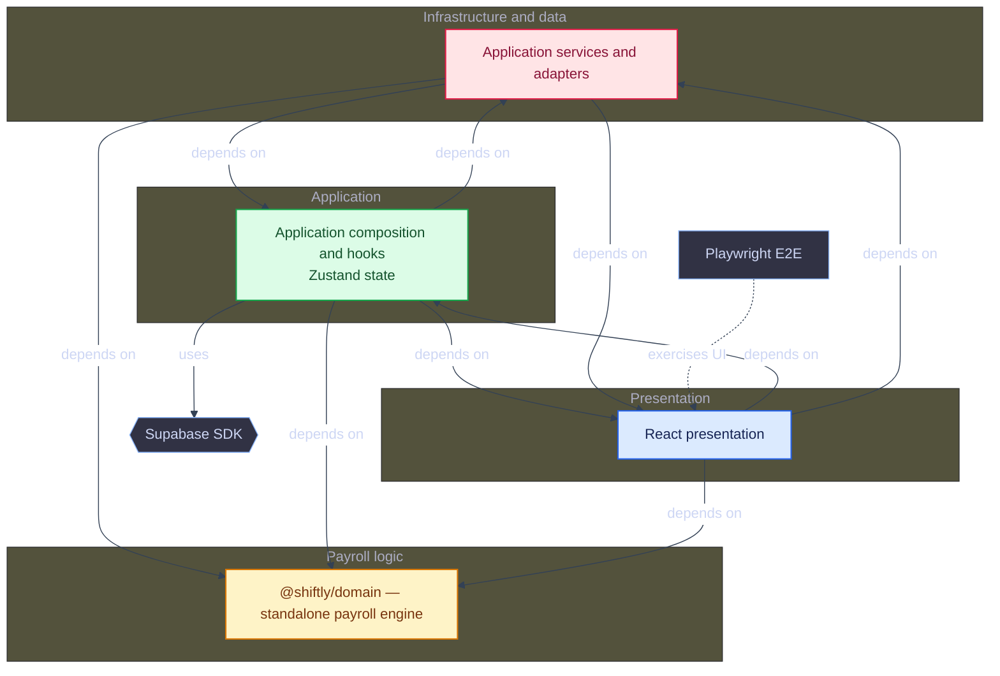
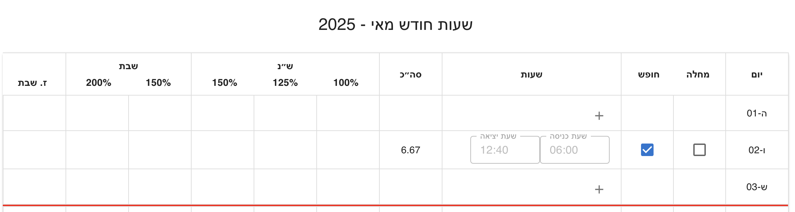

<div dir="rtl">

# Shiftly - מערכת לניהול שעות וחישוב שכר

> 📘 גרסה באנגלית זמינה כאן: [README.md](./README.md)

מערכת זו היא אפליקציה לניהול שעות עבודה וחישוב שכר מבוססת על **React + TypeScript**.
חישוב שכר כולל משמרות יומיות, ימים מיוחדים, אש״ל, כלכלה והכללים הנהוגים במשרדי ממשלה.

הפרויקט שם דגש לא רק על נכונות החישוב, אלא גם על **מידול דומיין ברור, יציבות ארכיטקטונית ותחזוקה ארוכת טווח**.

> ⚠️ המערכת מספקת חישוב אינדיקטיבי בלבד.  
> אין להסתמך על התוצאות לצורכי תלוש שכר רשמי,  
> והן אינן מחליפות חישוב המתבצע על ידי מדור שכר.

---

## מוטיבציה

Shiftly נולדה מבעיה אמיתית שנצפתה במשרד ממשלתי.

עובדים עוקבים אחר שעות העבודה לפי משמרות: בלוק רציף של שעות עם התחלה וסוף ברורים. תלוש השכר הישראלי לא מחושב כך, אלא לפי קטעים משוקללים: מדרגות שעות נוספות שמתחילות מחדש בכל יום עבודה, תוספות שבת וחג שנכנסות לתוקף בשעות מסוימות, ותוספות לילה שחוצות משמרת באמצע.

התוצאה היא תסכול צפוי מראש: העובד מקבל תלוש שאין לו דרך מעשית לאמת. Shiftly מגשרת על הפער. היא מקבלת משמרות כפי שהעובד חושב עליהן, ומחשבת שכר לפי הכללים הנהוגים במשרדי ממשלה, כך שכל סכום ניתן לבדיקה ולהסבר.

---

## עיקרון תכנוני מרכזי

העיקרון המרכזי מאחורי Shiftly הוא ש**לוגיקת החישוב נשארת יציבה לאורך זמן**.

חוקי השכר אינם משתנים לפי מימוש, אלא לפי **הקשר תקופתי**.
תאריכי לוח שנה, שכר שעתי, אש״ל וכלכלה מוגדרים כקלטים ולא כהתנהגות המקודדת בממשק.

בימים מיוחדים חלקיים, תחילת תעריף היום המיוחד נקבעת לפי כלל העסקי הנוכחי: **18:00 מאפריל עד ספטמבר ו־17:00 מאוקטובר עד מרץ**. תאריכים מתקבלים רק בפורמט `YYYY-MM-DD` ונבדקים כתאריכים קלנדריים תקינים.

גישה זו מאפשרת **חישוב לאחור של חודשים קודמים** באמצעות אותו שלד חישוב, רק עם פרמטרים תקופתיים שונים - ללא שינוי בקוד הדומיין.

---

## יכולות עיקריות

- חישוב שכר מבוסס משמרות
- תמיכה ב:
  - ימי עבודה רגילים
  - ימים מיוחדים חלקיים (למשל ימי שישי וערבי חג)
  - ימים מיוחדים מלאים (שבת, חגים)
- **זיהוי חגים באמצעות API של Hebcal**
  - פתרון אוטומטי של חגים יהודיים
  - הבחנה בין ימים מיוחדים מלאים לימים מיוחדים חלקיים
- ימי מחלה וחופשה
- משמרות החוצות יום
- חישוב אש״ל לפי ציר זמן היסטורי
- חישוב כלכלה (קטנה / גדולה)
- חישוב שכר שעתי אופציונלי: כאשר `baseRate > 0` מוצגות עמודת השכר היומי וסיכום השכר; מחיקה או הגדרה ל־`0` מסתירה אותן
- פירוט חודשי מצטבר
- חישוב אינקרמנטלי (הוספה / עדכון / הסרה של משמרות)
- ממשק משתמש ריאקטיבי לחלוטין
- ייצוא PDF אופקי מימין לשמאל עם הפרדה לפי שבועות, עמודות כלכלה עצמאיות, נתוני הגדרות בכל עמוד ו־footer של זכויות היוצרים
- התחברות אופציונלית עם Google ושמירת נתונים בין מכשירים
- פרופיל למשתמשים מחוברים עם כרטיס חשבון ושלושה גרפים היסטוריים, עם טווח חודשים משותף קבוע או מותאם אישית

---

## אימות ושמירת נתונים

מחשבוני השכר פועלים **גם ללא חשבון** — נתוני החישוב נשארים בזיכרון. הפרופיל האישי וההיסטוריה השמורה דורשים התחברות.

התחברות עם **חשבון Google** (דרך Supabase Auth) שומרת בנוסף את הנתונים שלך ב-Supabase, מקושרים לחשבון שלך, כך שהם נשארים זמינים בין הפעלות ובין מכשירים:

- **הגדרות חודשיות** — שנה, חודש, שעות תקן, שכר שעתי
- **סטטוס יום** — סימון מחלה / חופשה לכל יום
- **משמרות** — שעת התחלה, סיום ודגל תפקיד לכל משמרת שנשמרה
- **העברת זכות שבת** — שעות זכות שבת שלא נוצלו עוברות לחודש הבא במקום להיעלם

| טבלה | שומרת |
| --- | --- |
| `monthly_configs` | הגדרות לכל (משתמש, שנה, חודש), וגם יתרת זכות השבת המועברת |
| `work_days` | סטטוס לכל (משתמש, תאריך) (`sick` / `vacation`) — שורה חסרה משמעה `normal` |
| `shifts` | משמרות שנשמרו לכל משתמש, עם התאריך על כל שורה לצורך שאילתות ישירות |

שלוש הטבלאות מוגנות באמצעות Row Level Security של Postgres: כל משתמש יכול לקרוא ולכתוב רק את השורות שלו. הסכמה נמצאת ב-`supabase/migrations/`.

נתוני טבלת העבודה של משתמש מחובר נטענים באמצעות TanStack Query, עם מפתח מטמון המופרד לפי משתמש, שנה וחודש. העריכה זמינה רק לאחר השלמת הטעינה הראשונית, ובמקרה של כשל מוצגת פעולה מפורשת לניסיון חוזר. מעבר בין חשבונות מאפס את מצב העריכה לפני טעינת נתוני החשבון הבא.

הסיכום החודשי טוען ישירות את המשמרות ואת סטטוסי הימים השמורים כאשר השנה והחודש שנבחרו משתנים, ולכן אינו תלוי במעבר מוקדם לתצוגה היומית.

שינויים תקינים במשמרת נשמרים לאחר השהיה קצרה. פעולות כתיבה עבור אותו משתמש ואותו יום מתבצעות לפי הסדר, כדי שעדכון מאוחר לא יעקוף מחיקה שבוצעה אחריו. טיוטות עם שעות לא תקינות נשארות מקומיות עד לתיקונן.

---

## סקירת ארכיטקטורה

Shiftly מבוססת על עקרונות **Clean Architecture**, עם הפרדה ברורה בין לוגיקה עסקית, ממשק משתמש, ניהול מצב ושירותים חיצוניים.

המטרה היא לשמור על לוגיקת הדומיין **צפויה, ניתנת לבדיקה ובלתי תלויה בפריימוורקים**.

### זרימת חישוב כללית

Shiftly אינה ממדלת עבודה כסוגי משמרות קבועים. היא מפרשת ציר זמן אמיתי
ומפעילה כל כלל ברמה שבה הוא קיים:

```text
משמרות גולמיות
    ↓
סיווג ציר הזמן
    ↓
חישובי Regular / Special
    ↓
פירוט שכר יומי
    ↓
צבירה חודשית וכללים חודשיים בלבד
```

ההפרדה המרכזית היא:

- **Classification** — לאיזו קטגוריה שייך כל מקטע עבודה?
- **Calculation** — כיצד יש לתגמל את הזמן שסווג?
- **Aggregation** — מהו פירוט היום והסיכום החודשי?

כל כלל מופעל ברמה הטבעית שלו, והתוצאה מצטברת באופן דטרמיניסטי.

### סקירת מערכת

<details>
<summary>Overview</summary>



</details>

## שכבות מערכת

### דומיין

```mermaid
---
config:
  theme: base
  themeVariables:
    background: "#1e1e2e"
    primaryColor: "#313244"
    primaryTextColor: "#cdd6f4"
    primaryBorderColor: "#89b4fa"
    lineColor: "#334155"
    edgeLabelBackground: "#ffffff"
---
%% Source: main (HEAD). Module dependencies include type imports. Commit: 2f6d26699aa360b6758154d1ebc0bb23d53807fe.
%% Barrel re-exports are resolved; arrows point from consumers to dependencies.
flowchart TD
  subgraph group_domain["Payroll logic"]
    node_0["composition<br/>[packages/domain/src/composition.ts]"]
    node_1["buildDayLayer.pipeline<br/>[packages/domain/src/pipelines/buildDayLayer.pipeline.ts]"]
    node_2["buildResolvers.pipeline<br/>[packages/domain/src/pipelines/buildResolvers.pipeline.ts]"]
    node_3["buildMonthLayer.pipeline<br/>[packages/domain/src/pipelines/buildMonthLayer.pipeline.ts]"]
    node_4["buildCalculators.pipeline<br/>[packages/domain/src/pipelines/buildCalculators.pipeline.ts]"]
    node_5["buildCoreServices.pipeline<br/>[packages/domain/src/pipelines/buildCoreServices.pipeline.ts]"]
    node_6["shiftmap.builder<br/>[packages/domain/src/builder/shiftmap.builder.ts]"]
    node_7["daypaymap.builder<br/>[packages/domain/src/builder/daypaymap.builder.ts]"]
    node_8["workdaysformonth.builder<br/>[packages/domain/src/builder/workdaysformonth.builder.ts]"]
    node_9["timeline-shift-pay.calculator<br/>[packages/domain/src/calculator/timeline-shift-pay.calculator.ts]"]
    node_10["classify-shift-timeline<br/>[packages/domain/src/timeline/classify-shift-timeline.ts]"]
    node_11["month-pay-map.reducer<br/>[packages/domain/src/reducer/month-pay-map.reducer.ts]"]
    node_12["workdayinfo.resolver<br/>[packages/domain/src/resolve/workdayinfo.resolver.ts]"]
    node_13["date.service<br/>[packages/domain/src/services/date.service.ts]"]
    node_14["shift.service<br/>[packages/domain/src/services/shift.service.ts]"]
    node_15["perdiem-month.reducer<br/>[packages/domain/src/reducer/perdiem-month.reducer.ts]"]
    node_16["workday-month.reducer<br/>[packages/domain/src/reducer/workday-month.reducer.ts]"]
    node_17["fixed-segment-month.reducer<br/>[packages/domain/src/reducer/fixed-segment-month.reducer.ts]"]
    node_18["meal-allowance-month.reducer<br/>[packages/domain/src/reducer/meal-allowance-month.reducer.ts]"]
    node_19["buildShiftLayer.pipeline<br/>[packages/domain/src/pipelines/buildShiftLayer.pipeline.ts]"]
  end
  node_0 -->|"depends on"| node_4
  node_0 -->|"depends on"| node_5
  node_0 -->|"depends on"| node_1
  node_0 -->|"depends on"| node_3
  node_0 -->|"depends on"| node_2
  node_0 -->|"depends on"| node_19
  node_1 -->|"depends on"| node_7
  node_1 -->|"depends on"| node_8
  node_2 -->|"depends on"| node_12
  node_3 -->|"depends on"| node_17
  node_3 -->|"depends on"| node_18
  node_3 -->|"depends on"| node_11
  node_3 -->|"depends on"| node_15
  node_3 -->|"depends on"| node_16
  node_5 -->|"depends on"| node_13
  node_5 -->|"depends on"| node_14
  node_6 -->|"depends on"| node_14
  node_6 -->|"depends on"| node_13
  node_6 -->|"depends on"| node_10
  node_6 -->|"depends on"| node_9
  node_8 -->|"depends on"| node_12
  node_8 -->|"depends on"| node_13
  node_10 -->|"depends on"| node_13
  node_11 -->|"depends on"| node_17
  node_11 -->|"depends on"| node_18
  node_11 -->|"depends on"| node_16
  node_14 -->|"depends on"| node_13
  node_19 -->|"depends on"| node_6
  node_19 -->|"depends on"| node_9
  click node_0 "https://github.com/dmaman86/shiftly/blob/main/packages/domain/src/composition.ts"
  click node_1 "https://github.com/dmaman86/shiftly/blob/main/packages/domain/src/pipelines/buildDayLayer.pipeline.ts"
  click node_2 "https://github.com/dmaman86/shiftly/blob/main/packages/domain/src/pipelines/buildResolvers.pipeline.ts"
  click node_3 "https://github.com/dmaman86/shiftly/blob/main/packages/domain/src/pipelines/buildMonthLayer.pipeline.ts"
  click node_4 "https://github.com/dmaman86/shiftly/blob/main/packages/domain/src/pipelines/buildCalculators.pipeline.ts"
  click node_5 "https://github.com/dmaman86/shiftly/blob/main/packages/domain/src/pipelines/buildCoreServices.pipeline.ts"
  click node_6 "https://github.com/dmaman86/shiftly/blob/main/packages/domain/src/builder/shiftmap.builder.ts"
  click node_7 "https://github.com/dmaman86/shiftly/blob/main/packages/domain/src/builder/daypaymap.builder.ts"
  click node_8 "https://github.com/dmaman86/shiftly/blob/main/packages/domain/src/builder/workdaysformonth.builder.ts"
  click node_9 "https://github.com/dmaman86/shiftly/blob/main/packages/domain/src/calculator/timeline-shift-pay.calculator.ts"
  click node_10 "https://github.com/dmaman86/shiftly/blob/main/packages/domain/src/timeline/classify-shift-timeline.ts"
  click node_11 "https://github.com/dmaman86/shiftly/blob/main/packages/domain/src/reducer/month-pay-map.reducer.ts"
  click node_12 "https://github.com/dmaman86/shiftly/blob/main/packages/domain/src/resolve/workdayinfo.resolver.ts"
  click node_13 "https://github.com/dmaman86/shiftly/blob/main/packages/domain/src/services/date.service.ts"
  click node_14 "https://github.com/dmaman86/shiftly/blob/main/packages/domain/src/services/shift.service.ts"
  click node_15 "https://github.com/dmaman86/shiftly/blob/main/packages/domain/src/reducer/perdiem-month.reducer.ts"
  click node_16 "https://github.com/dmaman86/shiftly/blob/main/packages/domain/src/reducer/workday-month.reducer.ts"
  click node_17 "https://github.com/dmaman86/shiftly/blob/main/packages/domain/src/reducer/fixed-segment-month.reducer.ts"
  click node_18 "https://github.com/dmaman86/shiftly/blob/main/packages/domain/src/reducer/meal-allowance-month.reducer.ts"
  click node_19 "https://github.com/dmaman86/shiftly/blob/main/packages/domain/src/pipelines/buildShiftLayer.pipeline.ts"
  classDef toneAmber fill:#fef3c7,stroke:#d97706,stroke-width:1.5px,color:#78350f
  class node_0,node_1,node_2,node_3,node_4,node_5,node_6,node_7,node_8,node_9,node_10,node_11,node_12,node_13,node_14,node_15,node_16,node_17,node_18,node_19 toneAmber
```

<details>
<summary>Domain</summary>



</details>

שכבת הדומיין מכילה לוגיקה עסקית טהורה ואינה תלויה ב-React, בניהול המצב או בספריות חיצוניות.

- **Builders**
  בניית מבני נתונים מורכבים ללא חוקים עסקיים.

- **סיווג ציר זמן**
  חלוקת מקטעי עבודה שרירותיים ל־`Regular` או `Special` באופן הדדי־בלעדי,
  כולל חציות יום, חגים, שבתות והקשרים היסטוריים.

- **Pipelines לחישוב**
  צינורות טהורים ונפרדים לסיווג ציר הזמן, שעות בסיס רגילות, תוספות המבוססות
  על מדיניות תאריך, שעות מיוחדות, אש״ל, כלכלה וחיפוש תעריפים היסטוריים.

- **Reducers**
  צבירה וביטול צבירה של נתונים מחושבים, המאפשרים חישוב אינקרמנטלי.

- **Resolvers**
  שירותי החלטה מרובי-מתודות (סיווג סוג יום, חודשים זמינים) שאינם מצטמצמים לחישוב יחיד של קלט/פלט.

- **Composition**
  חיבור מרכזי של רכיבי הדומיין דרך `pipelines/`. ה־API הציבורי מורכב ב־`packages/domain/src/composition.ts` ומיוצא מ־`packages/domain/src/index.ts`; אפליקציית האינטרנט מייבאת את `@shiftly/domain` ומשלבת אותו דרך `apps/web/src/app/domain/domain.instance.ts`.

### תצוגה

```mermaid
---
config:
  theme: base
  themeVariables:
    background: "#1e1e2e"
    primaryColor: "#313244"
    primaryTextColor: "#cdd6f4"
    primaryBorderColor: "#89b4fa"
    lineColor: "#334155"
    edgeLabelBackground: "#ffffff"
---
%% Source: main (HEAD). Module dependencies include type imports. Commit: 2f6d26699aa360b6758154d1ebc0bb23d53807fe.
%% Barrel re-exports are resolved; arrows point from consumers to dependencies.
flowchart TD
  subgraph group_ui["Presentation"]
    node_0["App<br/>[apps/web/src/app/App.tsx]"]
    node_1["AppRoutes<br/>[apps/web/src/app/routes/AppRoutes.tsx]"]
    node_2["DailyPage<br/>[apps/web/src/pages/DailyPage.tsx]"]
    node_3["MonthlySummaryPage<br/>[apps/web/src/pages/MonthlySummaryPage.tsx]"]
    node_4["CalculationRulesPage<br/>[apps/web/src/pages/CalculationRulesPage.tsx]"]
    node_5["WorkTable<br/>[apps/web/src/features/work-table/components/month/WorkTable.tsx]"]
    node_6["GuestModeNotice<br/>[apps/web/src/features/auth/GuestModeNotice.tsx]"]
    node_7["GoogleSignInButton<br/>[apps/web/src/features/auth/GoogleSignInButton.tsx]"]
    node_8["GuestDraftConflictDialog<br/>[apps/web/src/features/guest-draft/GuestDraftConflictDialog.tsx]"]
    node_9["MonthlySalarySummary<br/>[apps/web/src/features/salary-summary/components/MonthlySalarySummary.tsx]"]
  end
  subgraph group_app["Application and state"]
    node_10["useDayController<br/>[apps/web/src/features/work-table/hooks/day/useDayController.ts]"]
  end
  subgraph group_data["Infrastructure and adapters"]
    node_11["dayToPayBreadownVM<br/>[apps/web/src/adapters/dayToPayBreadownVM.ts]"]
    node_12["monthToPayBreakdownVM<br/>[apps/web/src/adapters/monthToPayBreakdownVM.ts]"]
  end
  node_0 -->|"depends on"| node_1
  node_1 -->|"depends on"| node_2
  node_1 -->|"depends on"| node_3
  node_1 -->|"depends on"| node_4
  node_2 -->|"depends on"| node_5
  node_2 -->|"depends on"| node_9
  node_3 -->|"depends on"| node_9
  node_5 -->|"depends on"| node_6
  node_6 -->|"depends on"| node_7
  node_10 -->|"depends on"| node_11
  click node_0 "https://github.com/dmaman86/shiftly/blob/main/apps/web/src/app/App.tsx"
  click node_1 "https://github.com/dmaman86/shiftly/blob/main/apps/web/src/app/routes/AppRoutes.tsx"
  click node_2 "https://github.com/dmaman86/shiftly/blob/main/apps/web/src/pages/DailyPage.tsx"
  click node_3 "https://github.com/dmaman86/shiftly/blob/main/apps/web/src/pages/MonthlySummaryPage.tsx"
  click node_4 "https://github.com/dmaman86/shiftly/blob/main/apps/web/src/pages/CalculationRulesPage.tsx"
  click node_5 "https://github.com/dmaman86/shiftly/blob/main/apps/web/src/features/work-table/components/month/WorkTable.tsx"
  click node_6 "https://github.com/dmaman86/shiftly/blob/main/apps/web/src/features/auth/GuestModeNotice.tsx"
  click node_7 "https://github.com/dmaman86/shiftly/blob/main/apps/web/src/features/auth/GoogleSignInButton.tsx"
  click node_8 "https://github.com/dmaman86/shiftly/blob/main/apps/web/src/features/guest-draft/GuestDraftConflictDialog.tsx"
  click node_9 "https://github.com/dmaman86/shiftly/blob/main/apps/web/src/features/salary-summary/components/MonthlySalarySummary.tsx"
  click node_10 "https://github.com/dmaman86/shiftly/blob/main/apps/web/src/features/work-table/hooks/day/useDayController.ts"
  click node_11 "https://github.com/dmaman86/shiftly/blob/main/apps/web/src/adapters/dayToPayBreadownVM.ts"
  click node_12 "https://github.com/dmaman86/shiftly/blob/main/apps/web/src/adapters/monthToPayBreakdownVM.ts"
  classDef toneBlue fill:#dbeafe,stroke:#2563eb,stroke-width:1.5px,color:#172554
  class node_0,node_1,node_2,node_3,node_4,node_5,node_6,node_7,node_8,node_9 toneBlue
  classDef toneMint fill:#dcfce7,stroke:#16a34a,stroke-width:1.5px,color:#14532d
  class node_10 toneMint
  classDef toneRose fill:#ffe4e6,stroke:#e11d48,stroke-width:1.5px,color:#881337
  class node_11,node_12 toneRose
```

<details>
<summary>Presentation</summary>



</details>

#### טיפוסי האפליקציה וה־UI
`apps/web/src/app/` הוא שורש ההרכבה של אפליקציית האינטרנט. היא מייבאת את החבילה העצמאית `@shiftly/domain` ומשלבת את ה־API הציבורי שלה עבור React. לדוגמה, קוד האפליקציה קורא ל־`domain.payMap.calculateDayFromShifts(...)`.

חוזי הדומיין נמצאים תחת `packages/domain/src/types`. מודלים המיועדים ל־UI, כגון `PayBreakdownViewModel`, `CompactPayBreakdownVM` ו־`WorkDayInfo`, נמצאים תחת `apps/web/src/app/types`, משום שהם מתארים תצוגה ומצב אפליקטיבי ולא חוקי דומיין. Adapters וממפים של ה־features ממירים תוצאות דומיין למודלים האלו.

#### Hooks
שכבת תיאום דקה בין ה-UI, הדומיין וה-state.
אינה מכילה לוגיקה עסקית.

#### רכיבי UI
רכיבי תצוגה בלבד.
ה-UI מגיב לנתונים מחושבים ואינם מכיל חוקי שכר.

---

### אפליקציה

```mermaid
---
config:
  theme: base
  themeVariables:
    background: "#1e1e2e"
    primaryColor: "#313244"
    primaryTextColor: "#cdd6f4"
    primaryBorderColor: "#89b4fa"
    lineColor: "#334155"
    edgeLabelBackground: "#ffffff"
---
%% Source: main (HEAD). Module dependencies include type imports. Commit: 2f6d26699aa360b6758154d1ebc0bb23d53807fe.
%% Barrel re-exports are resolved; arrows point from consumers to dependencies.
flowchart TD
  subgraph group_app["Application and state"]
    node_0["AppProviders<br/>[apps/web/src/app/providers/AppProviders.tsx]"]
    node_1["AuthProvider<br/>[apps/web/src/app/providers/auth/AuthProvider.tsx]"]
    node_2["DomainProvider<br/>[apps/web/src/app/providers/domain/DomainProvider.tsx]"]
    node_3["domain.instance<br/>[apps/web/src/app/domain/domain.instance.ts]"]
    node_4["MonthlyDataProvider<br/>[apps/web/src/features/monthly-data/MonthlyDataProvider.tsx]"]
    node_5["GuestDraftImportProvider<br/>[apps/web/src/features/guest-draft/GuestDraftImportProvider.tsx]"]
    node_6["useGuestDraftCapture<br/>[apps/web/src/features/work-table/hooks/month/useGuestDraftCapture.ts]"]
    node_7["useWorkTableMonthSession<br/>[apps/web/src/features/work-table/hooks/month/useWorkTableMonthSession.ts]"]
    node_8["WorkTableDayStateProvider<br/>[apps/web/src/features/work-table/context/workTableDayState/WorkTableDayStateProvider.tsx]"]
    node_9["globalStore<br/>[apps/web/src/store/globalStore.ts]"]
    node_10["useAuth<br/>[apps/web/src/hooks/useAuth.ts]"]
    node_11["useDomain<br/>[apps/web/src/hooks/useDomain.ts]"]
    node_12["useGlobalState<br/>[apps/web/src/hooks/useGlobalState.ts]"]
    node_13["month.resolver<br/>[apps/web/src/app/months/month.resolver.ts]"]
    node_14["workdayinfo.presenter<br/>[apps/web/src/app/domain/workdayinfo.presenter.ts]"]
  end
  node_0 -->|"depends on"| node_1
  node_0 -->|"depends on"| node_2
  node_2 -->|"depends on"| node_3
  node_3 -->|"depends on"| node_13
  node_3 -->|"depends on"| node_14
  node_4 -->|"depends on"| node_10
  node_4 -->|"depends on"| node_12
  node_4 -->|"depends on"| node_9
  node_5 -->|"depends on"| node_10
  node_5 -->|"depends on"| node_11
  node_5 -->|"depends on"| node_12
  node_7 -->|"depends on"| node_10
  node_7 -->|"depends on"| node_12
  node_7 -->|"depends on"| node_9
  node_7 -->|"depends on"| node_6
  node_12 -->|"depends on"| node_9
  node_1 -->|"imports"| external_supabase
  external_supabase{{"Supabase SDK"}}
  click node_0 "https://github.com/dmaman86/shiftly/blob/main/apps/web/src/app/providers/AppProviders.tsx"
  click node_1 "https://github.com/dmaman86/shiftly/blob/main/apps/web/src/app/providers/auth/AuthProvider.tsx"
  click node_2 "https://github.com/dmaman86/shiftly/blob/main/apps/web/src/app/providers/domain/DomainProvider.tsx"
  click node_3 "https://github.com/dmaman86/shiftly/blob/main/apps/web/src/app/domain/domain.instance.ts"
  click node_4 "https://github.com/dmaman86/shiftly/blob/main/apps/web/src/features/monthly-data/MonthlyDataProvider.tsx"
  click node_5 "https://github.com/dmaman86/shiftly/blob/main/apps/web/src/features/guest-draft/GuestDraftImportProvider.tsx"
  click node_6 "https://github.com/dmaman86/shiftly/blob/main/apps/web/src/features/work-table/hooks/month/useGuestDraftCapture.ts"
  click node_7 "https://github.com/dmaman86/shiftly/blob/main/apps/web/src/features/work-table/hooks/month/useWorkTableMonthSession.ts"
  click node_8 "https://github.com/dmaman86/shiftly/blob/main/apps/web/src/features/work-table/context/workTableDayState/WorkTableDayStateProvider.tsx"
  click node_9 "https://github.com/dmaman86/shiftly/blob/main/apps/web/src/store/globalStore.ts"
  click node_10 "https://github.com/dmaman86/shiftly/blob/main/apps/web/src/hooks/useAuth.ts"
  click node_11 "https://github.com/dmaman86/shiftly/blob/main/apps/web/src/hooks/useDomain.ts"
  click node_12 "https://github.com/dmaman86/shiftly/blob/main/apps/web/src/hooks/useGlobalState.ts"
  click node_13 "https://github.com/dmaman86/shiftly/blob/main/apps/web/src/app/months/month.resolver.ts"
  click node_14 "https://github.com/dmaman86/shiftly/blob/main/apps/web/src/app/domain/workdayinfo.presenter.ts"
  classDef toneMint fill:#dcfce7,stroke:#16a34a,stroke-width:1.5px,color:#14532d
  class node_0,node_1,node_2,node_3,node_4,node_5,node_6,node_7,node_8,node_9,node_10,node_11,node_12,node_13,node_14 toneMint
```

<details>
<summary>Application</summary>



</details>

#### ניהול מצב
- **Zustand** מנהל את הגדרות התקופה הגלובליות ואת מפות השכר היומיות
- **React Context** מחזיק אימות, הזרקת תלויות, גבולות אינטגרציה ואת מצב העריכה הנוכחי של טבלת העבודה
- **TanStack Query** מתאם קריאות וכתיבות מאומתות של טבלת העבודה מול Supabase
- מפות השכר היומיות מתעדכנות לפי תאריך, והפירוט החודשי נגזר באופן דטרמיניסטי מהמפות הנוכחיות

מצב Zustand גלובלי:

- `apps/web/src/store/globalStore.ts`
- `apps/web/src/store/globalBreakdown.ts`

### נתונים

```mermaid
---
config:
  theme: base
  themeVariables:
    background: "#1e1e2e"
    primaryColor: "#313244"
    primaryTextColor: "#cdd6f4"
    primaryBorderColor: "#89b4fa"
    lineColor: "#334155"
    edgeLabelBackground: "#ffffff"
---
%% Source: main (HEAD). Module dependencies include type imports. Commit: 2f6d26699aa360b6758154d1ebc0bb23d53807fe.
%% Barrel re-exports are resolved; arrows point from consumers to dependencies.
flowchart TD
  subgraph group_data["Infrastructure and adapters"]
    node_0["supabase.crud<br/>[apps/web/src/services/supabase/supabase.crud.ts]"]
    node_1["supabase.client<br/>[apps/web/src/services/supabase/supabase.client.ts]"]
    node_2["shift.service<br/>[apps/web/src/services/shift/shift.service.ts]"]
    node_3["hebcal.service<br/>[apps/web/src/services/hebcal/hebcal.service.ts]"]
    node_4["account.service<br/>[apps/web/src/services/account/account.service.ts]"]
    node_5["workDay.service<br/>[apps/web/src/services/workDay/workDay.service.ts]"]
    node_6["calendar.service<br/>[apps/web/src/services/calendar/calendar.service.ts]"]
    node_7["analytics.service<br/>[apps/web/src/services/analytics/analytics.service.ts]"]
    node_8["guestDraft.service<br/>[apps/web/src/services/guestDraft/guestDraft.service.ts]"]
    node_9["monthlyConfig.service<br/>[apps/web/src/services/monthlyConfig/monthlyConfig.service.ts]"]
    node_10["guestDraft.storage<br/>[apps/web/src/services/guestDraft/guestDraft.storage.ts]"]
    node_11["hebcal.request<br/>[apps/web/src/services/hebcal/hebcal.request.ts]"]
    node_12["gtag<br/>[apps/web/src/services/analytics/gtag.ts]"]
    node_13["event.adapter<br/>[apps/web/src/adapters/event.adapter.ts]"]
    node_14["dayToPayBreadownVM<br/>[apps/web/src/adapters/dayToPayBreadownVM.ts]"]
    node_15["monthToPayBreakdownVM<br/>[apps/web/src/adapters/monthToPayBreakdownVM.ts]"]
  end
  node_0 -->|"depends on"| node_1
  node_2 -->|"depends on"| node_0
  node_3 -->|"depends on"| node_11
  node_4 -->|"depends on"| node_1
  node_5 -->|"depends on"| node_0
  node_8 -->|"depends on"| node_1
  node_8 -->|"depends on"| node_10
  node_9 -->|"depends on"| node_0
  node_10 -->|"depends on"| node_2
  node_10 -->|"depends on"| node_5
  node_1 -->|"imports"| external_supabase
  node_3 -->|"imports"| external_http
  node_6 -->|"imports"| external_http
  node_7 -->|"calls"| external_analytics
  node_12 -->|"calls"| external_analytics
  external_supabase{{"Supabase SDK"}}
  external_http{{"HTTP client (axios)"}}
  external_analytics{{"Google Analytics (gtag)"}}
  click node_0 "https://github.com/dmaman86/shiftly/blob/main/apps/web/src/services/supabase/supabase.crud.ts"
  click node_1 "https://github.com/dmaman86/shiftly/blob/main/apps/web/src/services/supabase/supabase.client.ts"
  click node_2 "https://github.com/dmaman86/shiftly/blob/main/apps/web/src/services/shift/shift.service.ts"
  click node_3 "https://github.com/dmaman86/shiftly/blob/main/apps/web/src/services/hebcal/hebcal.service.ts"
  click node_4 "https://github.com/dmaman86/shiftly/blob/main/apps/web/src/services/account/account.service.ts"
  click node_5 "https://github.com/dmaman86/shiftly/blob/main/apps/web/src/services/workDay/workDay.service.ts"
  click node_6 "https://github.com/dmaman86/shiftly/blob/main/apps/web/src/services/calendar/calendar.service.ts"
  click node_7 "https://github.com/dmaman86/shiftly/blob/main/apps/web/src/services/analytics/analytics.service.ts"
  click node_8 "https://github.com/dmaman86/shiftly/blob/main/apps/web/src/services/guestDraft/guestDraft.service.ts"
  click node_9 "https://github.com/dmaman86/shiftly/blob/main/apps/web/src/services/monthlyConfig/monthlyConfig.service.ts"
  click node_10 "https://github.com/dmaman86/shiftly/blob/main/apps/web/src/services/guestDraft/guestDraft.storage.ts"
  click node_11 "https://github.com/dmaman86/shiftly/blob/main/apps/web/src/services/hebcal/hebcal.request.ts"
  click node_12 "https://github.com/dmaman86/shiftly/blob/main/apps/web/src/services/analytics/gtag.ts"
  click node_13 "https://github.com/dmaman86/shiftly/blob/main/apps/web/src/adapters/event.adapter.ts"
  click node_14 "https://github.com/dmaman86/shiftly/blob/main/apps/web/src/adapters/dayToPayBreadownVM.ts"
  click node_15 "https://github.com/dmaman86/shiftly/blob/main/apps/web/src/adapters/monthToPayBreakdownVM.ts"
  classDef toneRose fill:#ffe4e6,stroke:#e11d48,stroke-width:1.5px,color:#881337
  class node_0,node_1,node_2,node_3,node_4,node_5,node_6,node_7,node_8,node_9,node_10,node_11,node_12,node_13,node_14,node_15 toneRose
```

<details>
<summary>Data</summary>



</details>

#### Adapters
המרת אובייקטי דומיין למודלי תצוגה עבור ה-UI, תוך שמירה על ניתוק מלא מהדומיין.

---
## מושגי דומיין

### Builders

אחראים להרכבת מבני דומיין:

- `ShiftMapBuilder`
- `DayPayMapBuilder`
- `WorkDaysForMonthBuilder`

`DefaultShiftMapBuilder` מנרמל כל משמרת תקינה לציר זמן רציף ומעביר אותה ל־`TimelineShiftPayCalculator`. לכן חציית חצות היא עניין של ציר הזמן, ולא מקרה נפרד בחישוב השכר.

### Calculators

לוגיקת חישוב טהורה מאורגנת לפי תחום:

- **סיווג ציר הזמן**: הפרדה בין `Regular` ל־`Special` לפני חישוב השכר
- **שעות בסיס רגילות**: התקדמות `100% → 125% → 150%`
- **תוספות**: `+20%` ערב ו־`+50%` לילה באמצעות policy המבוססת על תאריך
- **שעות מיוחדות**: `150%` ביום ו־`200%` בלילה, ללא תוספות רגילות
- **אש״ל**: תעריפים לפי ציר זמן וחישוב יומי; הצבירה החודשית מתבצעת ב־Reducer
- **כלכלה**: חישוב זכאות ותעריף ב־Calculator יחיד המבוסס על ציר זמן
- **מקטעים קבועים**: מחלה, חופשה וזכות שבת שנצברה
- **סיווג סוג יום לפי חג**: מבוסס Hebcal

ההתקדמות הבסיסית נצברת לאורך היום לפי ההגדרות `standardHours` ו־`midTierThreshold`: ברירת המחדל היא בדרך כלל 8 שעות תקן ושעתיים בדרגת הביניים. השעות הראשונות מחושבות ב־100%, הדרגה הבאה ב־125%, והיתרה ב־150%. גבולות שנוצרו על ידי סיווג הציר, חצות או זמן מיוחד אינם מאפסים את ההתקדמות. התוספות `+20%` ו־`+50%` מחושבות בנפרד באמצעות policy המבוססת על תאריך, כולל כלל זכאות של שלוש שעות כאשר הוא חל.

#### מונחים עבור זכות שבת

זכות שבת מיוצגת באמצעות שני ערכים נפרדים, משום שצבירת הזכות והשימוש בה הם אירועים עסקיים שונים:

- `earnedShabbatCredit` הוא הקרדיט שנצבר מעבודה בשבת או בחג. הוא נשמר במפות השכר היומיות והחודשיות של הדומיין ומהווה את מאגר הזכות החודשי.
- `appliedShabbatCredit` הוא החלק מתוך המאגר החודשי שהוקצה להשלמת חוסרי שעות. הוא קיים במודלי התצוגה, ורק הוא נכלל בסך השעות ובחישוב השכר.

המקצה החודשי שומר גם את מקור השעות שהוקצו באמצעות `usageByDate`.
עבור כל יום זכאי נשמר כמה שעות הגיעו מכל יום שצבר זכות וכמה הגיעו מהחודש הקודם.
סדר הצריכה הוא FIFO: קודם יתרה מהחודש הקודם, ולאחר מכן ימי הצבירה לפי סדר כרונולוגי.
מכיוון שההתמדה הנוכחית שומרת את יתרת החודש הקודם כמספר מצטבר, היא מוצגת
כ־`previous-month` ולא לפי תאריכים בודדים.

לדוגמה:

```text
2026-08-03 נוצלו 6.67 שעות:
  3.50 שעות מהחודש הקודם
  2.00 שעות מתאריך 2026-08-01
  1.17 שעות מתאריך 2026-08-02
```

המאגר החודשי יכול להשלים ימים ללא עבודה או ימים שבהם בוצעו פחות משעות התקן, כאשר סוג היום הוא `Regular` או `SpecialPartialStart`, ללא תלות במועד שבו הזכות נצברה במהלך החודש. ניתן להשלים כל יום עד שעות התקן שהוגדרו עבורו בלבד. החלוקה מתבצעת בסדר כרונולוגי כדי לשמור על תוצאה דטרמיניסטית וניתנת לבקרה.

יתרה שלא הוקצתה מוצגת כזכות שבת שלא נוצלה:

```text
unusedShabbatCredit = earnedShabbatCredit - appliedShabbatCredit
actualHours = worked hours
totalHours = worked hours + sick hours + vacation hours + appliedShabbatCredit
```

זכות שלא נוצלה מוצגת למשתמש, אך אינה נכללת בסך השעות או בחישוב השכר.

### Reducers

צבירה והפחתה של נתונים:

- Reducer חודשי למפת שכר
- צובר שעות רגילות
- Reducer חודשי למקטעים קבועים
- Reducer חודשי לאש״ל
- Reducer חודשי לימי עבודה

### Resolvers

שירותי החלטה מרובי-מתודות שאינם מצטמצמים לחישוב יחיד של קלט/פלט:

- Resolver חודש — חודשים זמינים וחודש ברירת מחדל לשנה נתונה
- Resolver מידע יום עבודה — שאילתות סוג יום והמשכיות בין ימים

### Services

כלי שירות ברמת הדומיין:

- `DateService`: טיפול ואימות תאריכים
- `ShiftService`: לוגיקה עסקית הקשורה למשמרות

### Pipelines

צינורות הרכבה לחיבור רכיבי דומיין:

- `buildCoreServices`: שירותי תאריך ומשמרת
- `buildResolvers`: מופעי Resolver חודש ומידע יום עבודה
- `buildRateCalculators`: מחשבוני חגים, תעריף אש״ל ותעריף כלכלה
- `buildCalculators`: מופעי Calculators
- `buildShiftLayer`: לוגיקה ברמת משמרת
- `buildDayLayer`: צבירה ברמת יום
- `buildMonthLayer`: צבירה ברמת חודש

---

## טכנולוגיות

### ליבה

- **React** 19.2.3
- **TypeScript** 5.7.2
- **Vite** 8

### State וניווט

- **Zustand** 5.0.15 (מצב גלובלי בצד הלקוח)
- **TanStack Query** 5 (סנכרון מצב שרת עבור משתמשים מחוברים)
- **React Router** 7

### UI ועיצוב

- **Material UI (MUI)** 7.0.2
- **Notistack** 3.0.2 (התראות)

### נתונים ושירותים

- **Axios** 1.18.1 (HTTP client)
- **date-fns** 4.1.0 (טיפול בתאריכים)
- **Hebcal API** (זיהוי חגים)
- **Supabase** 2.112.4 (התחברות Google + שמירת נתונים ב-Postgres)

### בדיקות

- **Vitest** 4
- **Testing Library** (React, Jest-DOM, User Event)
- **Playwright** 1.63 (בדיקות מקצה לקצה בדפדפן Chromium)

---

## מבנה הפרויקט

```plaintext
.
├── .github/
│   ├── assets/                 # צילומי מסך לקובצי README
│   └── workflows/              # CI, בדיקות pull request ופריסה
├── docs/
│   └── architecture/           # תרשימי ארכיטקטורה וגרסאות היסטוריות
├── e2e/                         # בדיקות Playwright מקצה לקצה ו-fixtures
├── playwright.config.ts         # הגדרות Playwright
├── scripts/
│   └── architecture/           # מחוללי תרשימי Mermaid
├── apps/web/src/
│   ├── adapters/               # מתאמי מידע חיצוני והמרה מהדומיין לתצוגה
│   ├── app/                    # שורש ההרכבה של האפליקציה
│   │   ├── domain/             # מופע הדומיין וטיפוסים לשכבת האפליקציה
│   │   ├── types/              # מודלים לשכבת האפליקציה ול־UI
│   │   ├── providers/          # ספקי אימות, כיוון, דומיין והתראות
│   │   └── routes/             # ניתוב האפליקציה וניתוב מותאם שפה
│   ├── constants/              # קבועי דומיין וממשק משותפים
│   ├── components/             # רכיבי ממשק משותפים להצגה
│   ├── features/               # ממשק ותיאום בבעלות כל פיצ'ר
│   │   ├── auth/               # פקדי התחברות Google
│   │   ├── calculation-rules/  # כללים ודוגמת חישוב אינטראקטיבית
│   │   ├── config/             # פרמטרי עבודה ושמירת תצורה חודשית
│   │   ├── feedback/           # התראות ומשוב למשתמש
│   │   ├── info-dialog/        # חלון מידע על האפליקציה
│   │   ├── monthly-data/       # טעינה ושמירה של תצורה חודשית
│   │   ├── monthly-pay/        # שכר חודשי מחושב והקצאת זיכוי שבת
│   │   │   └── hooks/          # חישוב הקצאה ושמירת העברה
│   │   ├── profile/            # היסטוריה לקריאה בלבד, מדדים, גרפים ובחירת טווח
│   │   ├── salary-summary/     # רכיבי שכר חודשיים ומודלי תצוגה
│   │   │   ├── components/     # תצוגת סיכום השכר
│   │   │   ├── helpers/        # בניית מקטעי השכר
│   │   │   ├── hooks/          # hooks לתיאום סיכום השכר
│   │   │   ├── mappers/        # מיפוי שורות שכר וקצבאות
│   │   │   └── vm/             # מודלי תצוגה של סיכום השכר
│   │   ├── work-table/         # עריכת חודש/יום/משמרת ותצוגות חישוב
│   │   │   ├── assets/         # נכסי פיצ'ר טבלת העבודה
│   │   │   ├── components/     # רכיבים לפי חודש, יום ומשמרת
│   │   │   ├── context/        # context למצב עריכת יום העבודה
│   │   │   ├── helpers/        # שינויי מצב ועזרי ייצוא PDF
│   │   │   ├── hooks/          # hooks לפי חודש, יום ומשמרת
│   │   │   └── mappers/        # מיפויים לפי חודש, יום ומשמרת
│   │   └── workday-timeline/   # ציר זמן חזותי של המשמרות
│   ├── hooks/          # hooks לתיאום סיכום השכר
│   │   │   ├── mappers/        # מיפוי שורות שכר וקצבאות
│   │   │   └── vm/             # מודלי תצוגה של סיכום השכר
│   │   ├── work-table/         # עריכת חודש/יום/משמרת ותצוגות חישוב
│   │   │   ├── assets/         # נכסי פיצ'ר טבלת העבודה
│   │   │   ├── components/     # רכיבים לפי חודש, יום ומשמרת
│   │   │   ├── context/        # context למצב עריכת יום העבודה
│   │   │   ├── helpers/        # שינויי מצב ועזרי ייצוא PDF
│   │   │   ├── hooks/          # hooks לפי חודש, יום ומשמרת
│   │   │   └── mappers/        # מיפויים לפי חודש, יום ומשמרת
│   │   └── workday-timeline/   # ציר זמן חזותי של המשמרות
│   ├── hooks/          # hooks לתיאום סיכום השכר
│   │   │   ├── mappers/        # מיפוי שורות שכר והטבות
│   │   │   └── vm/             # מודלי תצוגה של סיכום השכר
│   │   ├── work-table/         # עריכה וחישוב רספונסיביים לפי חודש, יום ומשמרת
│   │   │   ├── components/     # רכיבים המחולקים לחודש, יום ומשמרת
│   │   │   ├── context/        # context למצב העריך של יום העבודה
│   │   │   ├── helpers/        # שינויי מצב וייצוא PDF
│   │   │   ├── hooks/          # hooks המחולקים לחודש, יום ומשמרת
│   │   │   └── mappers/        # מיפויים המחולקים לחודש, יום ומשמרת
│   │   └── workday-timeline/   # ציר זמן חזותי למשמרות
│   ├── hooks/                  # React hooks משותפים לאינטגרציה
│   ├── i18n/                   # משאבי עברית/אנגלית וזיהוי שפה מהכתובת
│   ├── layout/                 # פריסת האפליקציה וגבולות שגיאה
│   ├── pages/                  # עמודים יומיים, חודשיים, כללי חישוב ופרופיל
│   ├── store/                  # מצב גלובלי באמצעות Zustand וחישובי פירוט
│   ├── services/               # לקוחות Analytics, Hebcal ושמירת Supabase
│   ├── test/                   # בדיקות אפליקציית האינטרנט, store, שירותים וממשק
│   └── utils/                  # טיפול בתוצאות API וכלי עזר משותפים
├── packages/
│   └── domain/
│       ├── src/                 # מנוע שכר עצמאי מפריימוורק ו־index.ts ציבורי
│       └── tests/               # בדיקות דומיין ללא תלות ב־React
└── supabase/
    ├── functions/               # Edge Functions מאומתות
    └── migrations/              # סכמת Postgres ומדיניות Row Level Security
```

---

## התנהגות ממשק המשתמש

## תצוגות מערכת

Shiftly כוללת שתי תצוגות חישוב עיקריות, עמוד כללים ציבורי ופרופיל למשתמשים מחוברים:

| נתיב | גישה | מטרה |
| --- | --- | --- |
| `/:lang/daily` | ציבורית | הזנת משמרות ופירוט יומי |
| `/:lang/monthly` | ציבורית | חישוב שכר חודשי |
| `/:lang/calculation-rules` | ציבורית | כללי חישוב, דוגמה אינטראקטיבית והדגמה |
| `/:lang/profile` | למשתמשים מחוברים | כרטיס חשבון והיסטוריה חודשית שמורה |

`:lang` הוא `he` או `en`; הנתיבים נמצאים תחת נתיב הבסיס המוגדר של האפליקציה.

### תצוגה יומית

- מיועדת להזנת משמרות יומיות
- מאפשרת הוספה, עריכה ובקרה של משמרות
- מציגה פירוק שכר יומי
- הסיכום החודשי מתעדכן באופן אינקרמנטלי
- מורידה את טבלת העבודה ישירות כקובץ PDF אופקי מימין לשמאל
- במובייל, בחירת יום מציגה את כרטיס היום כשהפרטים המורחבים סגורים כברירת מחדל. אפשרויות מחלה/חופשה, עריכת משמרות והסיכום המקוצר נשארים גלויים; פירוט השכר המלא נפתח לפי דרישה.

#### ייצוא PDF

- הכותרת משתמשת בחודש ובשנה שנבחרו: `שעות החודש {monthName} {year}`.
- בעמוד הראשון, מתחת לכותרת, מוצגים כתובת הדוא״ל של המשתמש המחובר אם קיימת, `baseRate` ו־`standardHours`.
- בעמודים נוספים נתוני ההגדרות חוזרים בכותרת, ובכל עמוד מוצג ה־footer של זכויות היוצרים של Shiftly.
- גבולות שבועיים מודגשים חזותית, ונתוני הכלכלה מיוצאים בשלוש עמודות נפרדות: `אש״ל`, `כלכלה גדולה` ו־`כלכלה קטנה`.
- ה־PDF נוצר עם טקסט Unicode מוטמע, לכן ניתן לבחור ולחפש את הכותרות, נתוני ההגדרות, כותרות העמודות, הערכים וה־footer, כולל תוכן בעברית.

### תצוגה חודשית

- מיועדת לניתוח שכר חודשי מצטבר
- מחייבת בחירת שנה וחודש
- מבטיחה דיוק תעריפי אש״ל וכלכלה לפי התקופה
- טוענת את המשמרות ואת סטטוסי הימים השמורים לתקופה שנבחרה באופן עצמאי מהתצוגה היומית
- מציגה סיכום חודשי קומפקטי וברור

שתי התצוגות משתמשות באותו מנגנון חישוב דומיין.
רק ההקשר וההצגה משתנים.

### פרופיל וגרפים היסטוריים

כרטיס החשבון נמצא בפרופיל, בנפרד מעמוד כללי החישוב הציבורי. הניווט במחשב ובמובייל מציג קישור לפרופיל רק למשתמשים מחוברים. כניסה ישירה לפרופיל ממתינה לאתחול האימות; אורחים מופנים ל־`/:lang/calculation-rules` באותה שפה, תוך שמירת פרמטרי השאילתה. מדיניות RLS של Supabase נשארת גבול הבעלות בצד השרת.

שלושת הגרפים משתמשים בהגדרות חודשיות, בסטטוסי ימים ובמשמרות שנשמרו:

- **שעות בפועל מול שעות לתשלום:** שעות בפועל אינן כוללות מחלה וחופשה; שעות לתשלום כוללות היעדרויות בתשלום וזיכוי שבת שנוצל, ללא מכפילי שעות נוספות.
- **שעות בסיס מול שעות נוספות:** שעות במקטע 100% מול השעות במקטעי 125% ו־150%. תוספות ערב, לילה ושבת אינן שעות עבודה נוספות.
- **הרכב סך התשלום:** שכר בסיס, תוספות וקצבאות מסתכמים לסך הברוטו המחושב בסיכום השכר ללא עריכות זמניות. התוספות כוללות את מלוא התשלום לשעות נוספות, לא רק את הפרמיה; הקצבאות כוללות אש״ל וארוחות. זה אינו שכר נטו או אישור לתשלום שהתקבל.

בורר אחד מעל שלושת הגרפים מציע את **3, 6 או 12 החודשים האחרונים**, את **השנה הנוכחית** (מינואר ועד החודש הנוכחי), ו־**חודש התחלה וסיום מותאמים אישית**. ברירת המחדל היא שישה חודשים. הטווח המותאם כולל את שני הקצוות ומוחל רק לאחר **החלת הטווח**; טיוטה לא תקינה או הפוכה אינה משנה את הטווח הפעיל. התאריכים מוגבלים לנובמבר 2015 ועד החודש הנוכחי, ורק החודש הנוכחי עצמו מסומן כחלקי.

ההיסטוריה היא לקריאה בלבד ומחושבת מחדש במנוע הדומיין הנוכחי, לא צילום שכר בלתי משתנה. היא משתמשת ביתרת זיכוי השבת השמורה מהחודש הקודם ואינה כוללת שינויי כמויות זמניים בסיכום השכר. נתונים חסרים נבדלים מחודש עם אפס שעות; תשלום אינו זמין ללא שכר שעתי חיובי שנשמר. כשל טעינה מציג אפשרות לניסיון חוזר במקום סכומים חלקיים בגרפים.

שאילתות ההיסטוריה מופרדות לפי משתמש ושני קצות הטווח, ממתינות לכתיבות או לייבוא פעילים, מבטלות תוצאות מיושנות וטוענות בקבוצות של שלושה חודשים. הגרפים כוללים tooltips למקלדת ולמגע וטבלאות ערכים מדויקים הנפתחות לפי דרישה, באמצעות רכיבי MUI ו־CSS קיימים. התרגומים באנגלית ובעברית נמצאים תחת `profile_page` בקובצי `pages.json` המתאימים, ללא namespace נפרד.

ראו [ניתוח נתוני הפרופיל (באנגלית)](../profile-analytics.md) להגדרות המדדים ולפרטי הבעלות על הנתונים.

### פאנל הגדרות (ConfigPanel)

רכיב ה־`ConfigPanel` מותאם להקשר הפעיל:

- **בתצוגה יומית**:
  - הגדרת שעות תקן ושכר שעתי
  - כאשר `baseRate > 0` מוצגים שכר יומי וסיכום השכר החודשי
  - מחיקת השכר השעתי או הגדרתו ל־`0` מסתירה את הפלט התלוי בשכר

- **בתצוגה חודשית**:
  - בחירת שנה וחודש היא הכרחית
  - מבטיחה תעריפי אש״ל וכלכלה מדויקים לפי התקופה
  - מחייבת הגדרת שכר שעתי לצורך חישוב

הפרדה זו מונעת חישוב שגוי ומחדדת אחריות.

### תצוגת יום עבודה

- אם `baseRate` הוא `0`: מוצגות רק שעות העבודה.
- אם `baseRate > 0`: מוצגים עמודת שכר יומי, שכר יומי וסיכום שכר חודשי.
- **ימי מחלה / חופשה**: לא מאפשרים הזנת משמרות.
- **שבת / חג**: מאפשרים עבודה בלבד (ללא היעדרות).
- **משמרת חוצה יום**: דורשת אישור מפורש מהמשתמש.
- **כרטיסי יום במובייל**: שעות נוספות, שבת, תוספות, זכות שבת ופרטי פירוט נוספים מוסתרים עד להרחבת הכרטיס.
- כאשר נעשה שימוש בזכות שבת, היום מציג את סך השעות שנוצלו ואת מקורותיהן, כולל ימי הצבירה והחודש הקודם. בתצוגת מחשב ההסבר מוצג בשורה אחת; במובייל המקורות מוצגים בשורות נפרדות.

### הדגמות E2E

<details>
<summary>זרימת אוגוסט 2026 בעברית במחשב</summary>


</details>

<details>
<summary>זרימת אוגוסט 2026 בעברית במובייל</summary>


</details>

### לוגיקת הגדרת יום עבודה

**שבת או חג - עבודה מותרת**

- לא ניתן לסמן יום כמחלה או חופש, אך ניתן להזין משמרות עבודה.
  

**יום מחלה או חופש - ללא משמרות עבודה**

- כאשר יום מסומן כמחלה או חופש, לא ניתן להזין בו משמרות עבודה.
  
  

**משמרת חוצה יום - תיבת סימון ״חוצה יום״**

- כאשר שעת הסיום היא ביום הבא המערכת מבקשת אישור מפורש על חציית יום.
  
  

**סיכום פירוט יומי - תצוגת מחשב**

|                                 פרטים סגורים                                  |                                 פרטים מורחבים                                  |
| :----------------------------------------------------------------------------: | :-----------------------------------------------------------------------------: |
|  |  |

**סיכום פירוט יומי - תצוגת מובייל**

|                                פרטים סגורים                                 |                                פרטים מורחבים                                 |
| :---------------------------------------------------------------------------: | :----------------------------------------------------------------------------: |
|  |  |

**סיכום חודשי**


---

## למה ארכיטקטורה זו?

הארכיטקטורה נבחרה כדי להתמודד עם:

- חוקי שכר מורכבים
- מקרי קצה מבוססי זמן
- רמות צבירה שונות (משמרת → יום → חודש)
- חישוב אינקרמנטלי ללא חישוב מחדש מלא
- דיוק היסטורי ללא שינוי בלוגיקה הליבה

היא מאפשרת התפתחות עתידית של המערכת **בלי להעמיס לוגיקה מותנית ברכיבי ה-UI**.

---

## הערות מימוש

- כל האחוזים מנורמלים (לדוגמה: `1` = 100%, `1.5` = 150%, `2` = 200%)
- לוגיקת הדומיין בלתי תלויה בפריימוורק וניתנת לבדיקה באופן מלא
- ה־UI מגיב לנתונים ולא מכיל חוקים עסקיים
- משמרות Duty/Meal Allowance מוצגות כ־`Duty` בתצוגת ההדפסה באנגלית וכ־`תפקיד` בתצוגת ההדפסה בעברית
- חישובים היסטוריים משתמשים בהקשר מבוסס זמן, לא בשינויי קוד

---

## בדיקות

Shiftly משתמשת ב־**Vitest** לבדיקות יחידה ואינטגרציה, עם דגש על אימות לוגיקת הדומיין.

### הרצת בדיקות

```bash
# הרצת בדיקות במצב watch
bun run test

# הרצת בדיקות עם ממשק UI
bun run test:ui

# הרצת בדיקות עם כיסוי קוד
bun run test:coverage

# הרצת בדיקות במצב CI (הרצה חד־פעמית)
bun run test:ci
```

### בדיקות End-to-End

הבדיקות מחולקות לפי מה שכל רמה מוכיחה:

| רמה | היקף |
|---|---|
| Unit (Vitest) | כללי הדומיין, שירותים, mappers ורכיבים |
| Integration (Vitest) | כל fixture של חודש מלא דרך מסלול החישוב של האפליקציה, ללא דפדפן |
| Desktop E2E (Playwright, Chromium) | הזנת חודש מלא דרך הטבלה באנגלית ובעברית, וכן פריסה ברוחב טאבלט |
| Mobile E2E (Playwright, Android + iPhone) | בחירת חודש בבורר המודאלי, עריכת משמרות וניווט בתפריט ללא גלילה אופקית; הזנת חודש מלא דרך לוח השנה וכרטיס היום ב־Android |

בדיקות המובייל רצות על שני פרופילים: `android` (Pixel 10, Chromium) ו־`iphone` (iPhone 15, WebKit). זרימת החודש המלא רצה רק ב־Android, משום ש־WebKit ללא ממשק ב־Linux של ה־CI זקוק לכמה דקות עבורה, ותוצאות החודש אינן תלויות במנוע הדפדפן. כל הבדיקות רצות עם שעון קבוע (`e2e/support/app.ts`), כך שהתרחישים אינם תלויים בתאריך הנוכחי.

יש להתקין את דפדפני Playwright פעם אחת לאחר התקנת התלויות:

```bash
playwright install chromium webkit
```

הרצת בדיקות הקצה לקצה:

```bash
# הרצת בדיקות E2E
bun run test:e2e

# פתיחת ממשק Playwright
bun run test:e2e:ui

# הרצה עם דפדפן גלוי
bun run test:e2e:headed
```

תרחישי החודש המלאים (קובצי הקלט והתוצאות הצפויות) נמצאים תחת:

```text
e2e/
├── fixtures/
│   ├── august-2026.json / august-2026.result.json
│   ├── march-2022.json / march-2022.result.json
│   ├── october-2021.json / october-2021.result.json
│   └── october-2025.json / october-2025.result.json
├── support/          # טעינת תרחישים, עיצוב ערכים והכנת האפליקציה
├── desktop/          # פרויקט "desktop"
│   ├── work-table-month.spec.ts
│   └── tablet-layout.spec.ts
└── mobile/           # פרויקטים "android" ו־"iphone"
    ├── work-table-month.spec.ts   # Android בלבד
    ├── month-picker.spec.ts
    ├── shift-editing.spec.ts
    └── navigation.spec.ts
```

כל ה־fixtures נבדקים בבדיקת האינטגרציה של Vitest `apps/web/src/test/integration/work-table-month-fixtures.test.ts`, שמריצה את אותו מסלול חישוב של האפליקציה ללא דפדפן. Playwright מריץ דרך הממשק רק את תרחיש אוגוסט 2026.

מקומית, שרת ה־E2E מפעיל את שרת הפיתוח של Vite על `127.0.0.1` עם נתיב הבסיס `/shiftly`. ב־CI הוא מגיש את `dist/` המוכן מראש באמצעות `vite preview`. שירות Hebcal מדומה בבדיקות כדי לשמור על תרחישים דטרמיניסטיים.
ה־workflow של ה־CI מתקין Chromium ו־WebKit ומריץ את חבילת בדיקות ה־E2E באופן אוטומטי.

### בדיקות איכות ובניית גרסת Production

```bash
# בדיקת טיפוסים של האפליקציה ושל הגדרות Vite
bun run typecheck

# הרצת ניתוח סטטי
bun run lint

# יצירת חבילת production בתיקייה dist/
bun run build
```

### כיסוי בדיקות

הבדיקות מכסות:

- לוגיקת חישוב (builders, calculators, reducers)
- פתרונות מבוססי זמן (חגים, תעריפים, מקטעים)
- מקרי קצה (משמרות חוצות יום, ימים חלקיים, מחלה/חופשה)
- התנהגות ממשק ההגדרות וטבלת העבודה, כולל הצגת השכר בעת שינוי `baseRate`
- תרחישי חישוב מקצה לקצה

שכבת הדומיין ניתנת לבדיקה באופן מלא ובלתי תלויה בפריימוורק, מה שמקל על אימות חוקים עסקיים בבידוד.

---

## התחלה מהירה

Shiftly דורשת Node.js 24. Bun 1.3.14 מוגדר כמנהל החבילות המועדף ב־`package.json`, אך פקודות הסקריפטים עצמן תואמות ל־npm ול־Bun. גרסת Node.js המדויקת של ה־CI מוגדרת בקובץ `.nvmrc`.

```bash
git clone https://github.com/dmaman86/shiftly.git
cd shiftly
nvm install
nvm use
bun install
bun run dev

# מנהל חבילות חלופי:
# bun install --frozen-lockfile
# bun run dev
```

כניסה ל־`http://localhost:5173/shiftly` בדפדפן.

### הגדרת Supabase (אופציונלי)

מצב אורח עובד בלי שום הגדרה — שום דבר לא נשמר, ואין צורך בחשבון.

כדי להפעיל התחברות עם Google ושמירת נתונים בין מכשירים, צרו קובץ `.env.local` עם פרטי הפרויקט שלכם ב-Supabase:

```bash
VITE_SUPABASE_URL=
VITE_SUPABASE_PUBLISHABLE_KEY=
```

לאחר מכן הריצו את קבצי ה-SQL תחת `supabase/migrations/`, לפי הסדר, ב-SQL Editor של פרויקט ה-Supabase שלכם, כדי ליצור את הטבלאות `monthly_configs`, `work_days` ו-`shifts` עם מדיניות ה-Row Level Security שלהן.

מחיקת חשבון דורשת את Supabase Edge Function בשם `delete-account`, כי מחיקה מ-`auth.users` דורשת מפתח סודי בצד שרת. לאחר קישור הפרויקט, פרסו אותה כך:

```bash
supabase functions deploy delete-account
```

הפונקציה מאמתת את ה-JWT של המשתמש המחובר ומוחקת את אותו משתמש מ-Supabase Auth. מאחר שהטבלאות משתמשות ב-`on delete cascade`, הרשומות של המשתמש ב-`monthly_configs`, `work_days` ו-`shifts` נמחקות על ידי בסיס הנתונים.

---

## רישיון

הפרויקט מופץ תחת רישיון [MIT](../../LICENSE).

</div>
